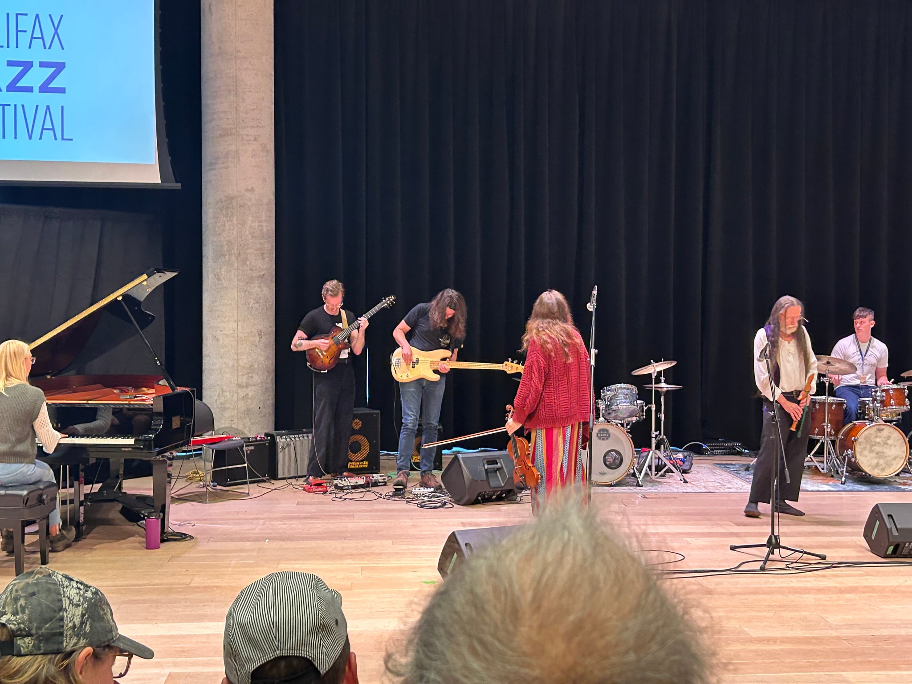

┌──────────═━┈🐝┈━═──────────┐

this july i ended up doing a lot of things i didn't want to do. it felt hard to do things i wanted.

however, it started really nice with a trip to the blue cottage with my love. we got to do nothing together so that was really nice!

on july 7th my mom turned 60! the past few birthdays she's talked about how lucky she feels to be older than her mom ever got to be. that must be a bittersweet feeling, i don't know what that feels like. we went for pizza, it was a debacle getting everyone together but it was good pizza. mine had honey on it :)

it took me over 12 hours to clean this car but it looks good now. it's at the shop now; hopefully we can get it running properly.

i went to one of the concrete house watercolour days. i couldn't put as much time into the painting as i wanted, but this dried up palette looked cool.

we got to see orion and ewan's hard work culminate at the cmw performance at the hfx library. it was wild to see so many people care so much about the creative process, looking at it from the outside in. it felt very hopeful in that room.

july isn't over yet and the next couple days are busy. d&d is tonight!

i hope i can be cozy like iggy pop soon.

└──────────═━┈🐝┈━═──────────┘
