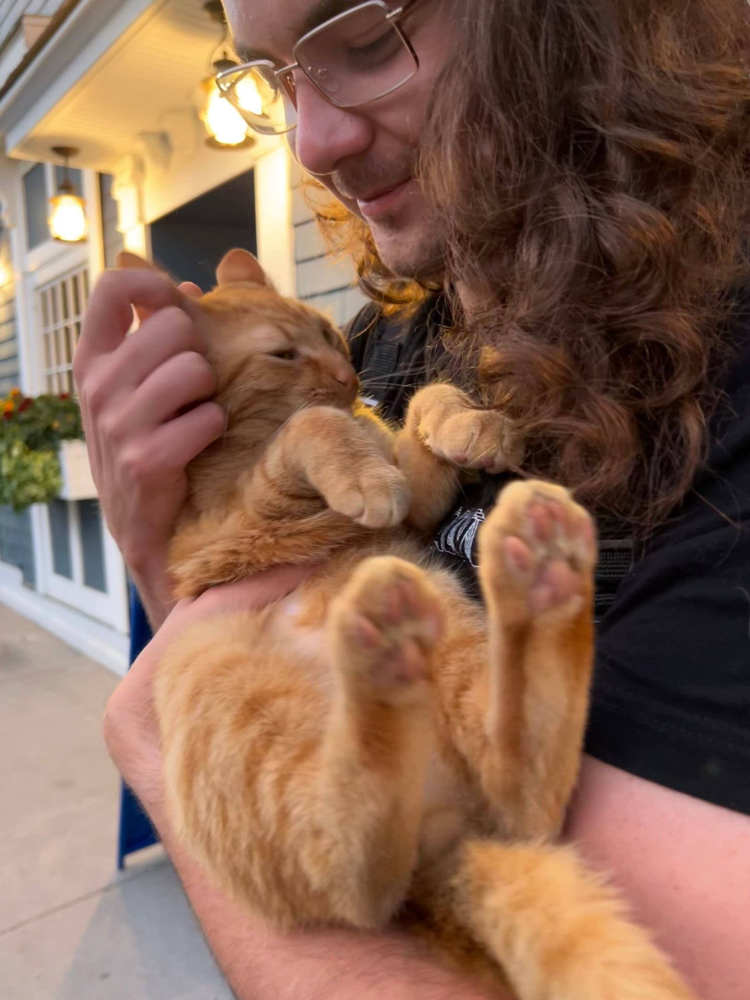
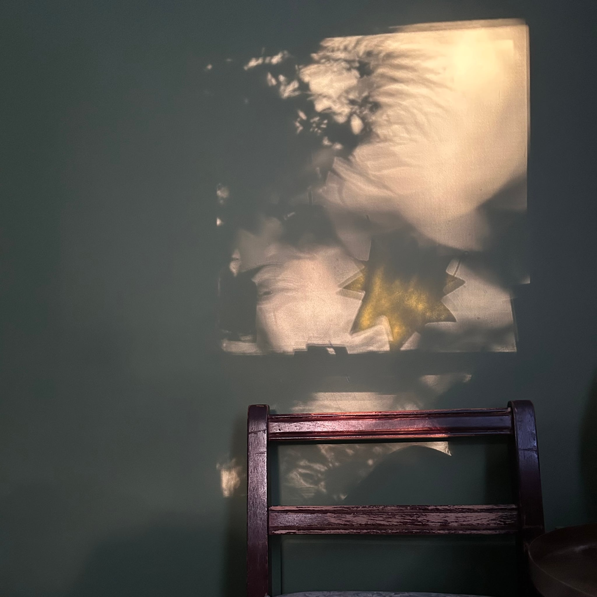

⋇⊶⊰❣⊱⊷⋇✧⋇⊶⊰❣⊱⊷⋇

lately weekends have been jam packed! i am at the concrete house today, i've missed being here in the quiet.

this weekend is abby's birthday get-together, some like it hot, and a car show my dad wants me to go to in uniacke. jane and i made abby a salad, i'm really glad she liked it. 

the folk art fest was crazy and fun, there was of course much folk art to be admired. my favourite was folk art that others might not consider folk art.

 and \\"reflection\\" (frog)")

we are going to miss seeing amelia every week!!!!!!!!!!!!! she invited us over for board games at rev. nicole's, we played botany it was very fun and i enjoyed the trinkets and collecting/sorting, also the aesthetics, which is allowed.

we were very very very excited to learn that minoosh loves a basket. jane's basket is perfectly minoosh sized!!!!!!

more on cats: we went to the jazz jam in chester at the f'ocs'le, and upon leaving the premises we were greeted by this kitty, who was just a great little lad.

this is what i get to see when i wake up early on a sunny morning. a moment of serenity before my brain starts thinking.

⋇⊶⊰❣⊱⊷⋇✧⋇⊶⊰❣⊱⊷⋇
