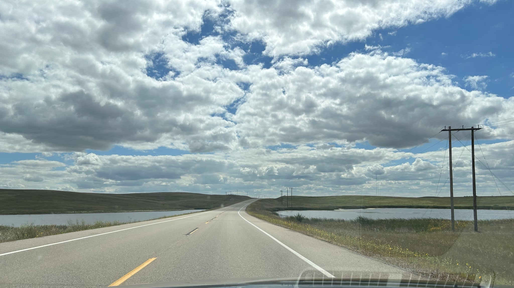
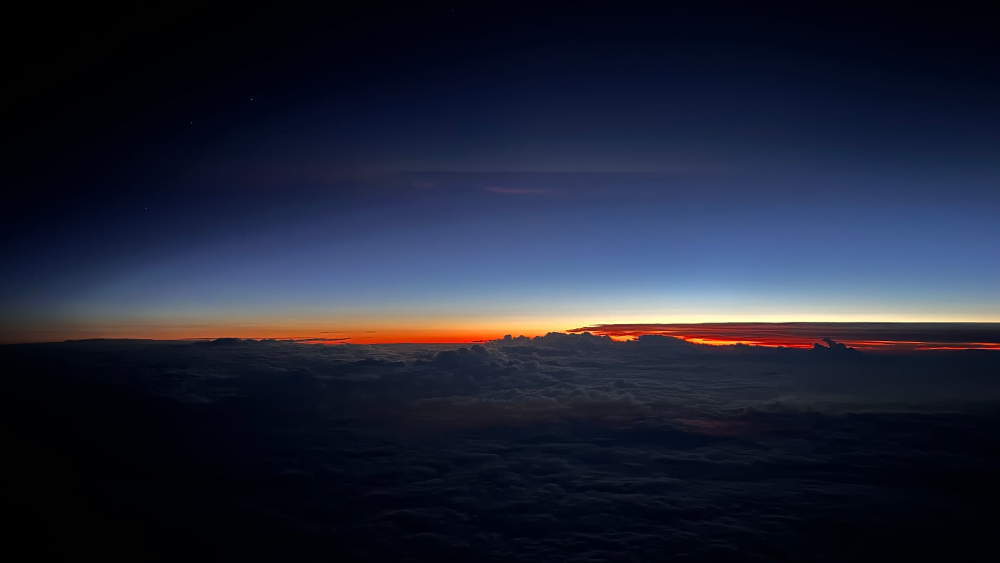

# ♡❀˖⁺. ༶ ⋆˙⊹❀♡ﾟ･\*:.｡\*:ﾟ･♡

### forever tangled

last weekend i went to saskatchewan for my friend emily's wedding! we worked at tangled garden together and became friends. 

i have not travelled a lot so it was a bit of a nervous time with all of the flights and new places, but it ended up going okay. 

after i got to regina, the next morning i drove down to estevan, where the wedding was held. i love driving on new roads and to new places so this was fun, so many fields and crop dusters and cows and clouds! and oil derricks and pump jacks... people were telling me to get lots of pictures, most of them are of the sky and stuff. i did not get many wedding pics, it felt weird that people were taking pics during the ceremony.

emily made her own dress! it was linen and so pretty with a big soft bow in the back (do i have a good picture of it? absolutely not). her dance outfit was all white lululemon to "maximize punch-dancing potential". it was very much *emily's* wedding.

she a very kind person and works very hard for her art, she truly does whatever she sets her mind to. i had never actually met allan but he's a dm as well so that's probably a good sign. he has a very good laugh and so does emily so that is good too.

there were a lot of acadia grads here since emily is also one! zoe and valmy were there so i am glad i knew at least someone. valmy is so kind and i am also so happy to run into her everywhere. we all took a photo together but who knows when i'll get it sent lol.

never having been to a wedding before, and not being part of any church, there was a lot of things i was not at all used to. lots of jesus, prayers, and blessings. it made me think of so many questions about marriage and the systems it functions in. i don't really know how to feel about it all, especially since it's something that is so deeply ingrained in how you're supposed to do life. my parents got married two days before i was born, i was told my dad asked the officiant to bring a witness. they've never had rings.

i was able to catch only two sunsets and one sunrise the trip was so short! more good drives back.

i was very loopy and tired after the three hours time difference.

♡❀˖⁺. ༶ ⋆˙⊹❀♡ﾟ･\*:.｡\*:ﾟ･♡

### in other news

it's almost halloween! i fricken love tiny bags of chips. it's my birthday next week. i was trying to get my brother down too (we share a birthday) but seems like he doesn't want to. he never comes down here we're always going there.

i went to the canning kitchen party after "work" (my one piano lesson of the day), and got to squaredance, then went to the concrete house for the hootenanny (which i had forgotten about). by the time i got there i was pretty tired but it was still nice. we had ice cream and jane and orion required touching grass.

deep roots is very soon and things are starting to get chaotic. three weekly meetings in a row. deadlines fast. september is going to blow up with so much stuff to do. i'm dreading the stress. the summer hasn't alleviated much of it since i'm the brokest i've ever been and didn't really get time away from everything. i really hope we can get back to d&d soon, it's like three weeks :( 

# ♡❀˖⁺. ༶ ⋆˙⊹❀♡ﾟ･\*:.｡\*:ﾟ･♡
