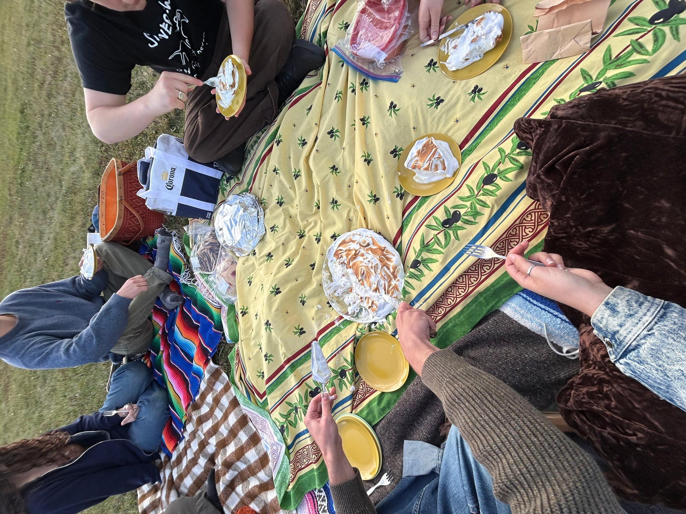

woah! september has been a rough month. there have been some good things though so i'll just do those :)

it was my birthday! my family had us over for chinese food. i had many crunchy spring rolls. orion took me cafe-hopping and we ended up at a cute little japanese listening room in hfx.

orion baked me a beautiful lemon meringue pie that was so sweet and tart and had truly the flakiest pie crust ever. it was so nice to have a chill sunset picnic by the water with very cool people :)

Abby made gorgeous delicious apple danishes!!!

deep roots is this weekend! mere days away! the excitement fills the air with everyone bustling around preparing. i'm really looking forward to tonights's twilight chapel show. it's the honey harvest on saturday so i'll be in avondale for that then back to the festival! here's a funny picture from last year when i couldn't make it.

that little car is fixed it drives now! it is very fun to drive even if it's a little loud. i worked hard on sunday to get the back seat covers replaced. i reattached the rear view mirror. i haven't washed the car but that will happen eventually haha. hoping to bring it to the drive in if they show some slashers or something.

