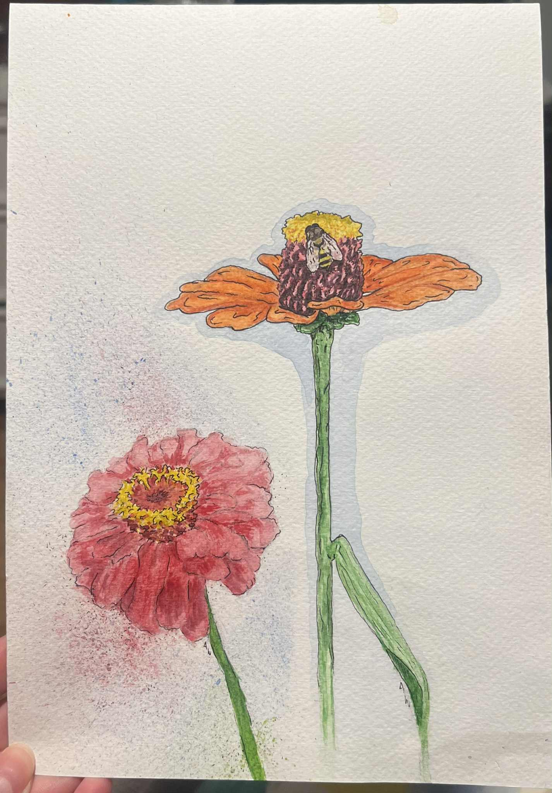
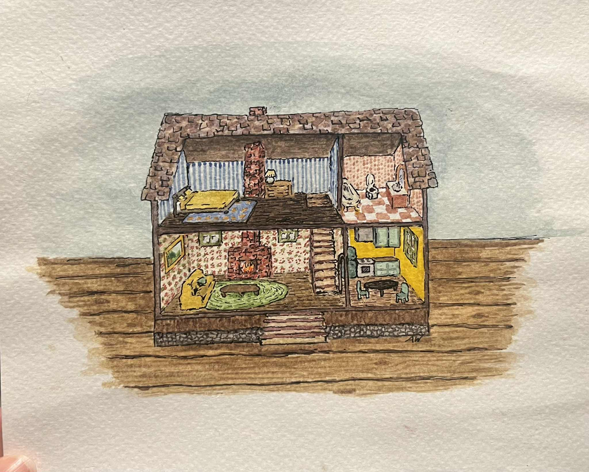
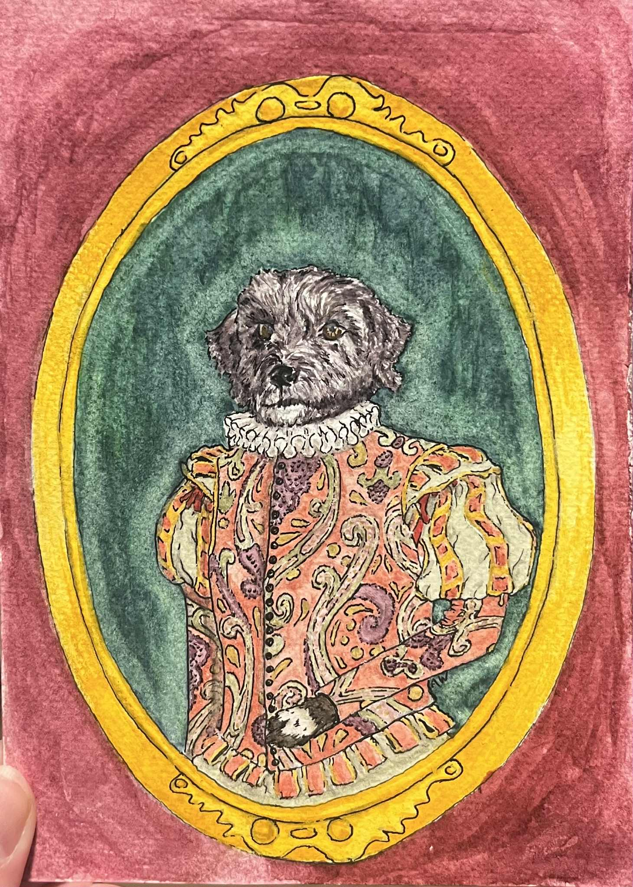

Hello! 🦋

I did a LOT of water colour painting this past weekend! Though, that only amounts to two complete paintings and a side of flowers- but I definitely spent a lot of time focused on all the little details and fun design aspects!

Would 100% recommend drawing/painting a dollhouse- it very much gave me the interior decorating joy of the Sims4 but with a physical pay-off (or paINT-off, haha 🙃)!

Also painted my parents dog Pepper (who I am still not 100% convinced isn’t a prince turned into a dog by a witch) in his true, rightfully entitled form lol. 

Anyway, I mostly began this painting spell because having something physical to show for my effort made my brain feel less guilty. Which got me thinking about my perception of “productivity”. 

While painting I tried to tell myself, “I’m not *wasting* time, I’m honing my art skills”. But I couldn’t help but feel it still wasn’t a *productive* use of time. 

And once again I found myself confronting guilt for practicing something I had no intention of monetizing. 

This is something I’ve been trying to unlearn for a long time- the capitalist mindset of “you could sell that!” being the highest compliment one can receive. But I’m certainly getting better at re-framing things I do for joy, and just for me. :) 

Looking forward to more painting! 

Will probably try to bring my watercolour set with me when traveling next week- maybe I’ll paint a German bier! XP

Missing you all in the valley- still just feels like I’m visiting Halifax and'll be back soon!!
