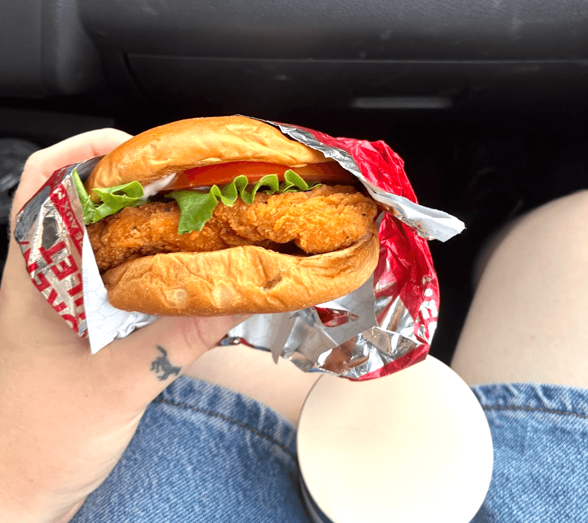

so excited that many of my favourite people are now authors on this website too! hi everyone!

## nic's birthday
of course, the most important event of the week, and perhaps the year, was nic's birthday. 23 on the 23rd! this is Nic's 5th trip around the sun since we first started going out, and I swear he gets better each year. for his birthday, he's going to get himself a banjo and I'm very excited for that, even if he just plays cripple creek over and over each day for the rest of our lives. anyway, he inspires me in many ways - how he cooks without recipes, makes me laugh even when I'm determined not to, and loves music and sharing it with people so unconditionally. 

for his birthday, we contemplated doing big things like halifax or shubenacadie wildlife preserve, but ended up staying in town. we went to Troy for dinner and i made, dare i say, my best cake ever. it was a nice rich chocolate cake with layers of cream cheese frosting, berry filling, and chocolate ganache. and then decorated it with edible flowers i grew from seed and a hand-dipped beeswax candle. i was grateful for a cozy night in town, hopefully he was too.

Saturday was a nice little celebration! a picnic and then we watched Smokey and the Bandit. the grass was very plush, the weather was splendid, the company was even better. matt's plate - pictured below - was picturesque. I'm a big fan of that movie, but I was torn between it and Fried Green Tomatoes, so maybe we can watch that sometime.

  

    
  

  

    
  

  

    
  

  

    
  

## horses
two new horses at fairytail fields! one is named ferny, I forget the other's name. words can't describe how much i love these horses. without my dear friend, Spaghetti, my life would not be complete. Spaghetti wears boots because she has some hoof issues - they're so cute but there's a hole from her wearing them so much, so new boots are coming in the mail. can't wait to get them muddy! the horses smell so nice this time of year because Gina uses this lemongrass scented fly spray. I'm so lucky to spend time there and learn from Gina and the horses. if I could braid manes all day every day, I would.

  

    
  

  

    
  

  

    
  

  

    
  

anyway, I also wanted to show you my favourite barn cat. He has a different name but I call him Bitey. he loves to roll in the dirt and bite and be held like a baby. 

this is Jughead, but I call him thumbs due to his massive thumbs. he is known for his terrific purr. 

<audio controls>
  <source src="/blog/jane/2025-06-30/Fat barn cat purring.m4a" type="audio/mpeg">
  Your browser does not support the audio element.
</audio>

I'll photograph more of the cats for you next week. There are lots.

## wendy's chicken burger

I would like to take a moment to appreciate the wendy’s chicken burger for all it has done for me. from childhood until present. 

## concrete news

had fun hosting the visible mending workshop today! finally feeling confident with swiss darning. finally put a patch Ewan made on my jacket! if you ever need a hand with a mend, let me know. I say fuck fast fashion by making my mends colourful and loud.

here's a very simple zine I put together about mending. likely all info you already know, but let me know if you want a printed copy:

also wanted to say, the open mic was so lovely. moments like that are what life's all about for me. Beans in my Ears was definitely the highlight of the show. can't wait to do it again on August 30th - save the date! 

Check out Orion's post for a nice capture of one of the little chipmunks that lives at the museum. Looking forward to hanging the Holly Worthington's cyanotype show this weekend. 

  

    
  

  

    
  

  

    
  

  

    
  

the morning fog on the waterfront has been lovely, but I'm ready for this heatwave to pass. it's far too hot for me to have a cold. 

talk to you soon! 

xoxo Jane

