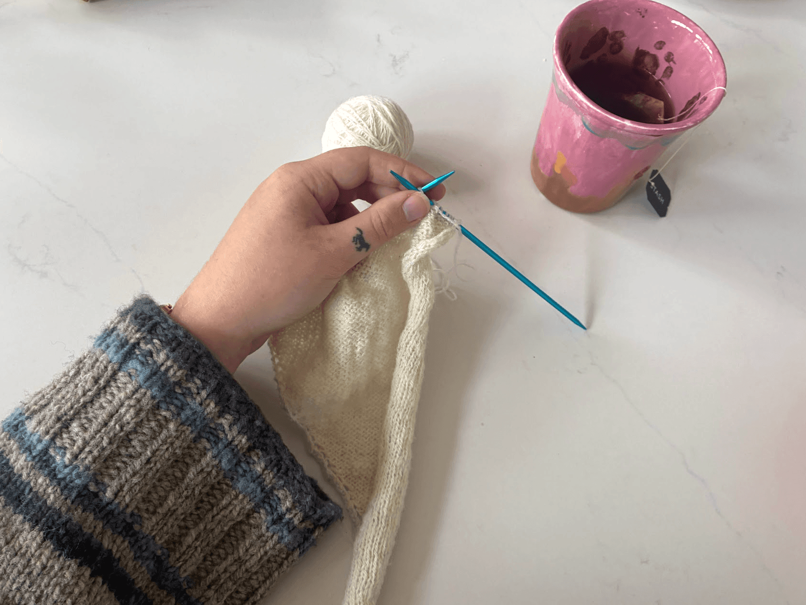
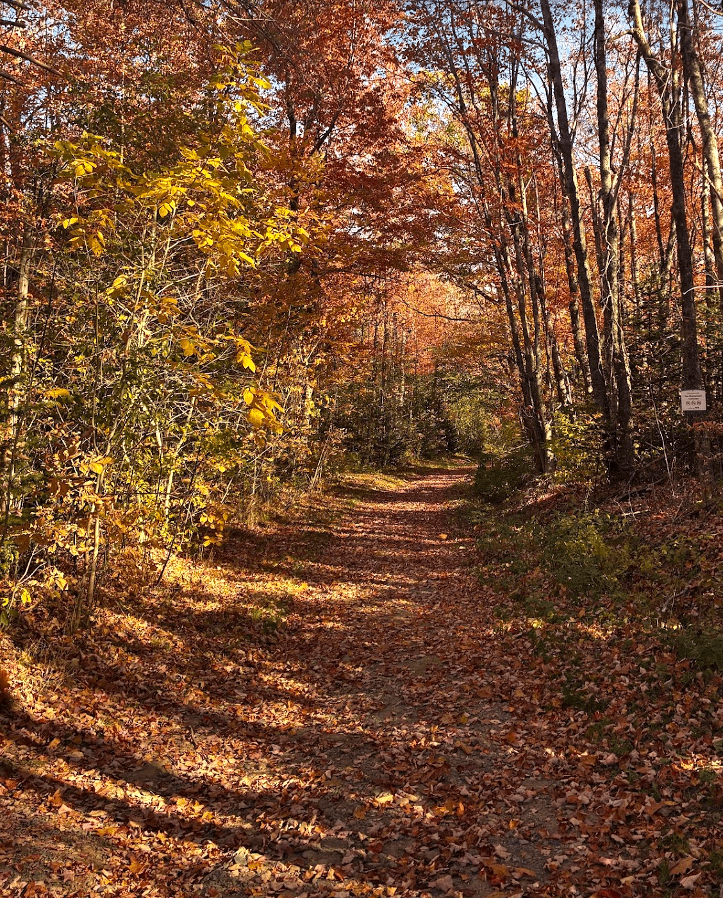
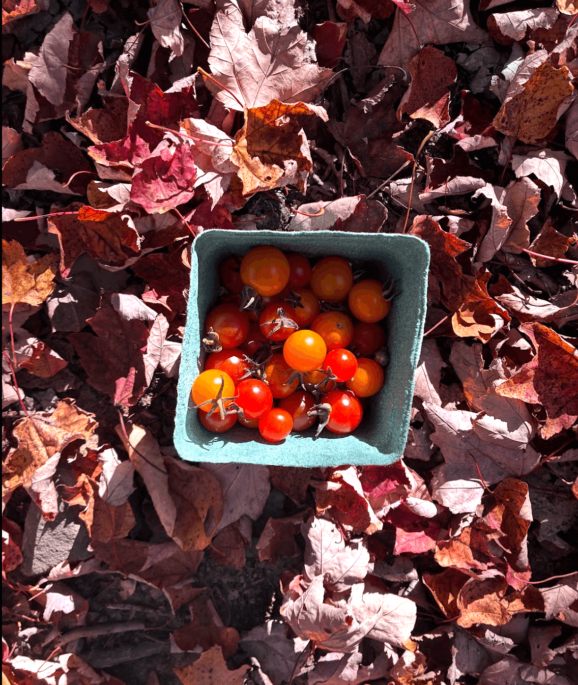
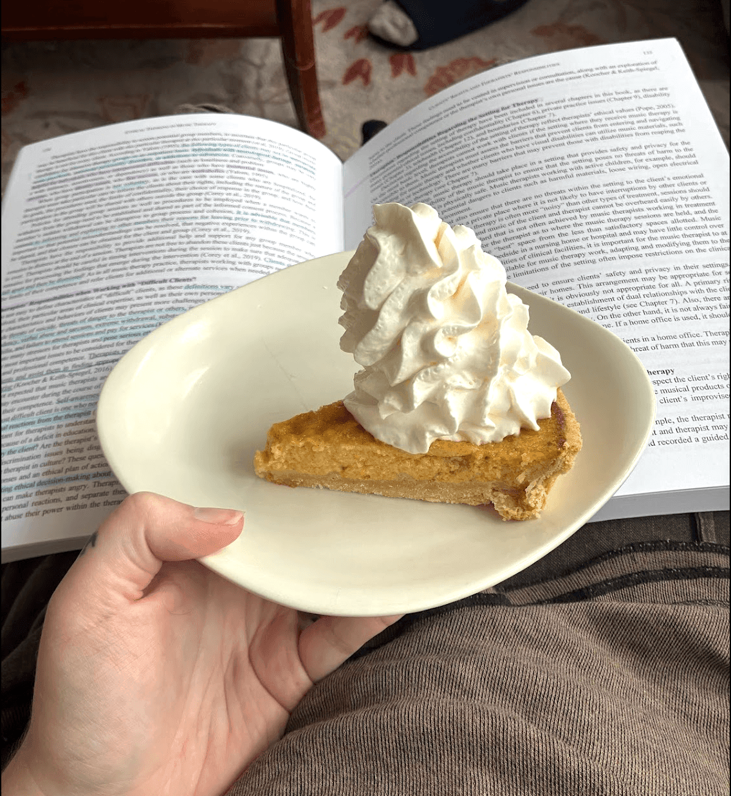
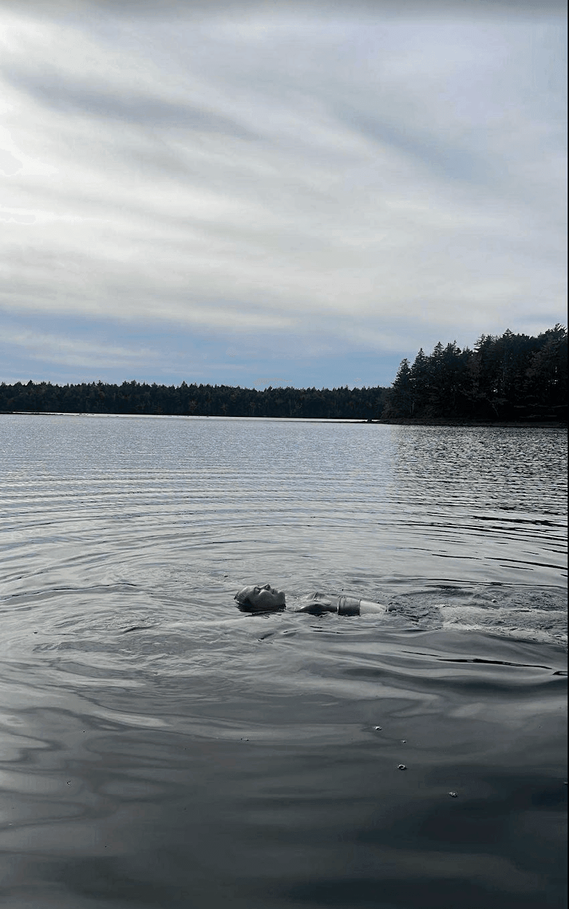
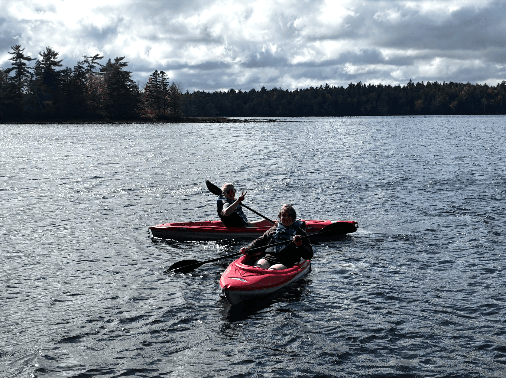
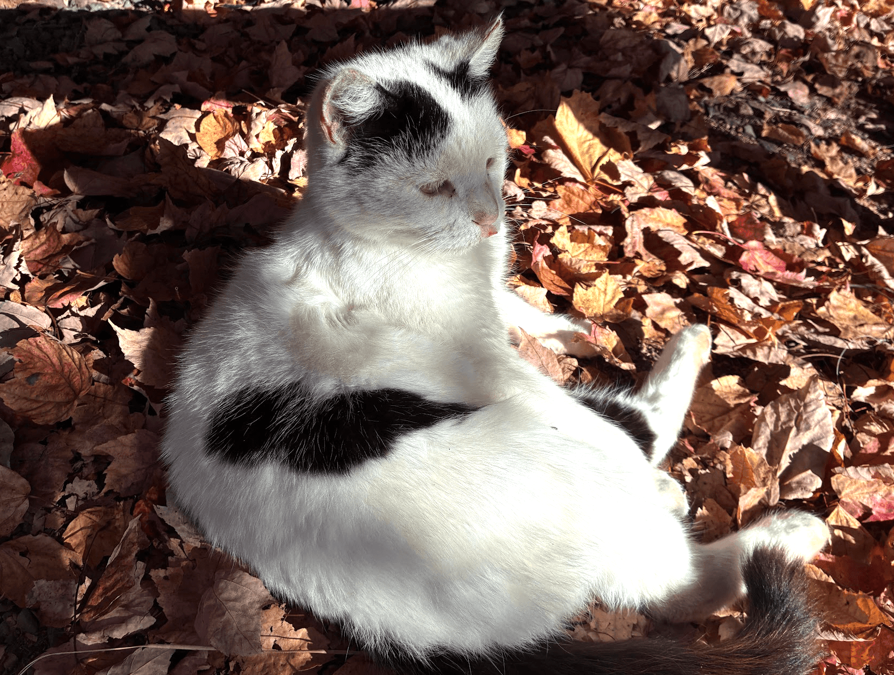
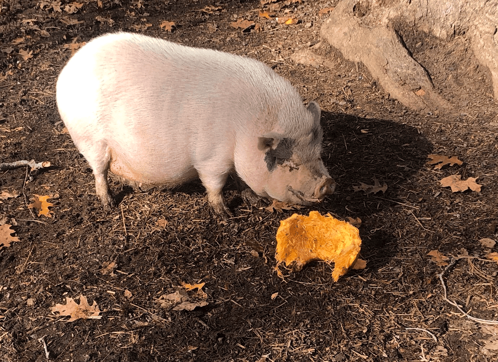
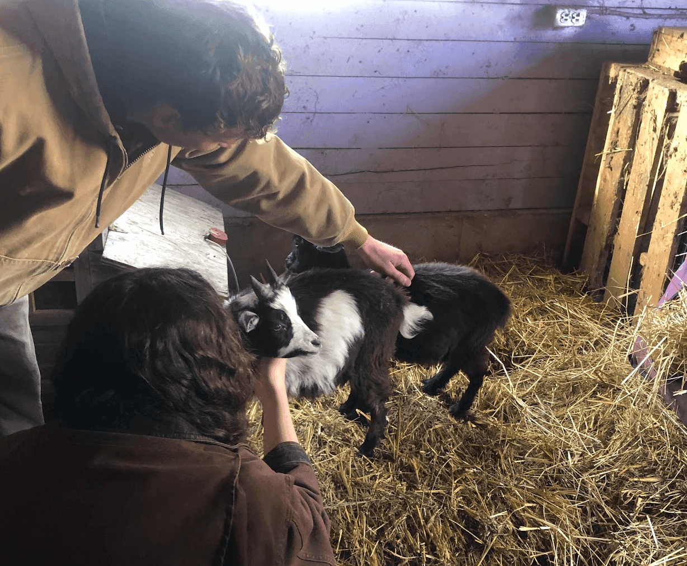

hey, it's been a while...

currently in the library "studying" and thought a new blog post might be a fantastic method of procrastination

## knitting

finished [Nic's socks](https://www.ravelry.com/projects/jay777marie/dk-weight-vanilla-socks) (I think the day after my last post?). Ran out of orange yarn so he gets a funky toe. DK socks are fun... fingering weight not so much. I guess I am a little impatient haha.

Since it's gotten cold, I've been getting a lot of wear out of the sweaters I've made. Would love to cast on another over winter break

## swimming

on a ridiculously warm october day, Willow and I went for a lovely swim between my classes. tried my best to soak in the feeling of warm moss under my feet, and all the warm colours.

my next swim was much colder... but serves as a segue into the next heading

## amelia's cottage

spent reading week at Amelia's cottage with Orion, Adèsse, and, for a brief period, Nic. can't imagine a better place to study than by a big window looking over a lake. I kayaked and made a purple-velvet cake with toothpaste-coloured icing. it was a very luxurious getaway with terrific company and fancy soups.

while in the area, we went to Lunenberg for a day and I picked up some records:

\- The Time of the Foxgloves, micheal Hurley

\- Sweetkorn, Micheal Hurley

\- Stuff Like That There, Yo La Tengo

\- Souvenirs, Emahoy Tsege Mariam Gebru

\- Elliott Smith, Elliott Smith

\- Foggy Mountain Breakdown, Flatt & Scruggs (nic finally obtained a banjo and has been feeling the Scruggs spirit)

Goat Life and Death

said hello to two baby goats and goodbye to Prince the goat - feeling closer to the circle of goat life than ever. pigs and goats alike seem to be thrilled about all the pumpkins left over from Halloween. Sheep and horses are starting to fluff up for the cold weather approaching.

I also got to attend a workshop with [Shelby Dennis](https://www.facebook.com/milestoneequestrian96) talking about positive reinforcement with horses. there's such a need for things to shift with the culture of horsemanship, horses deserve better!

