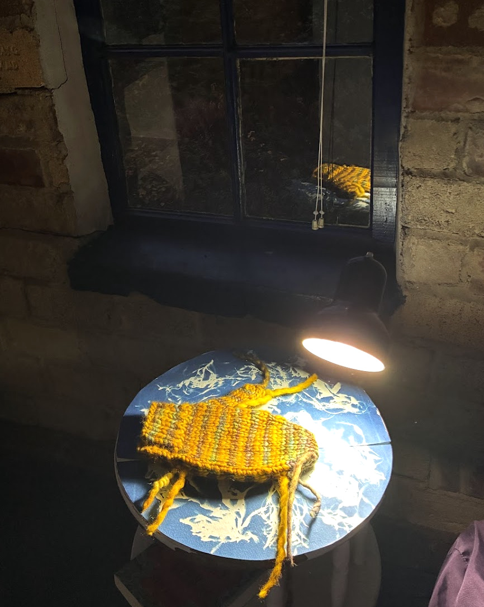
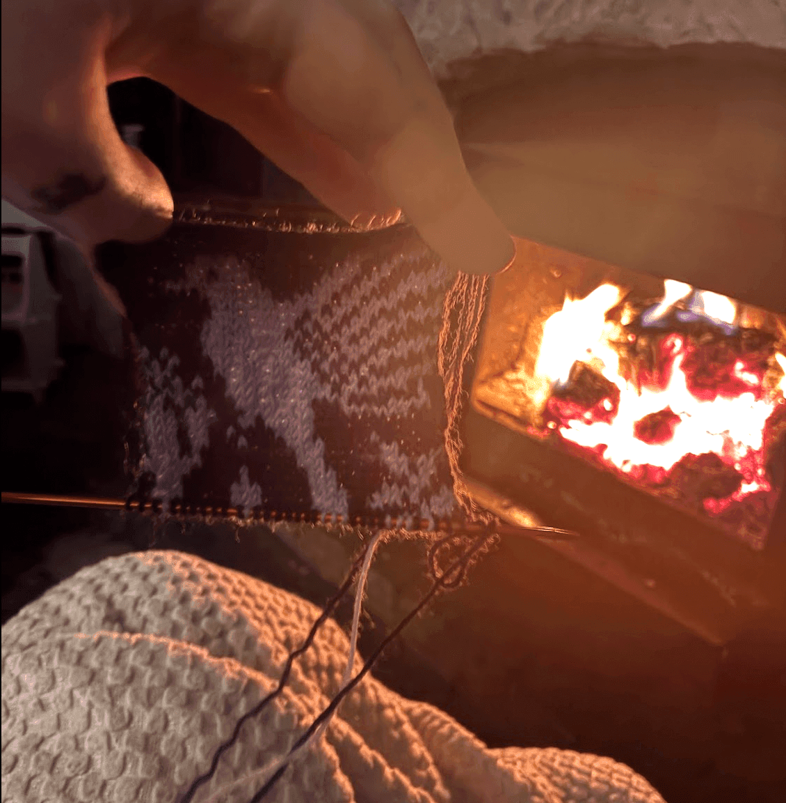
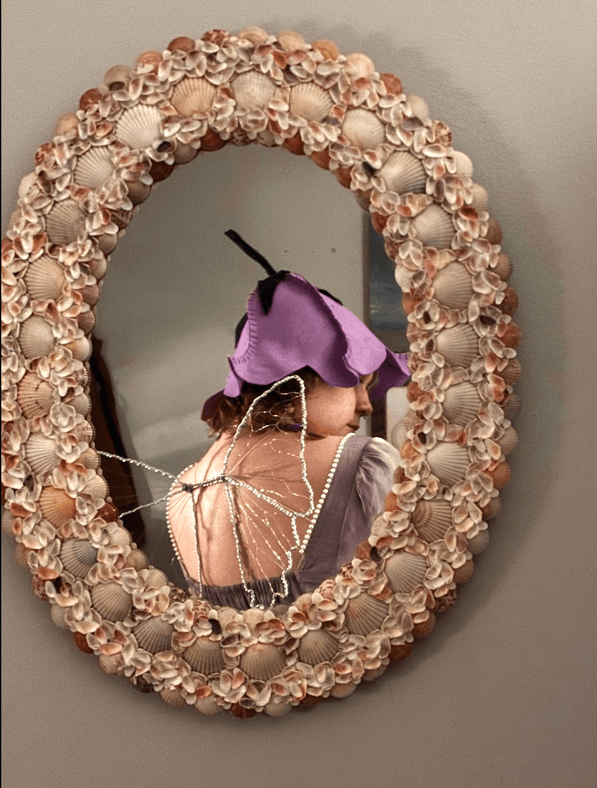
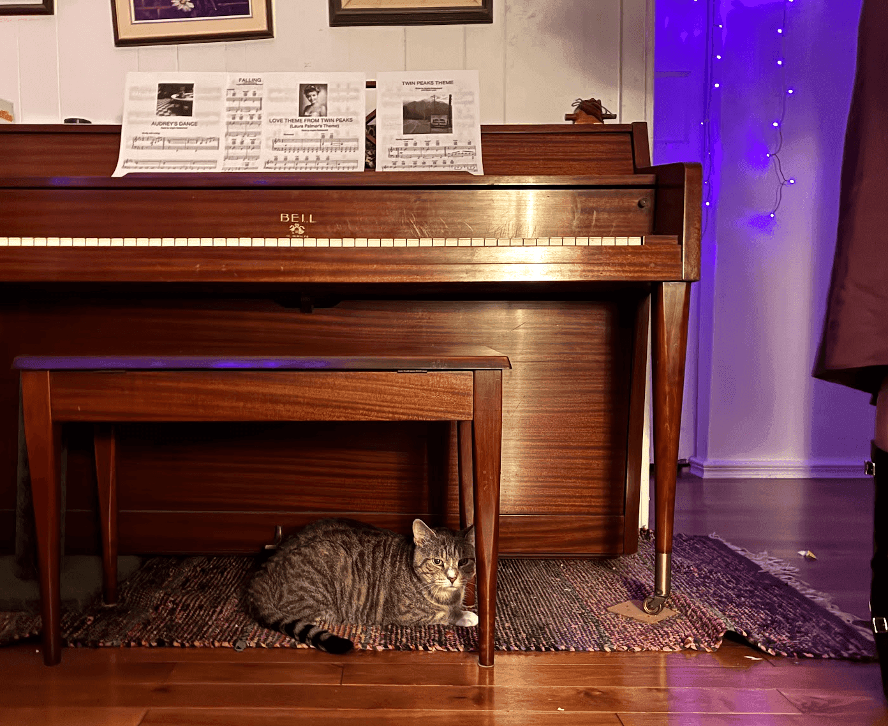
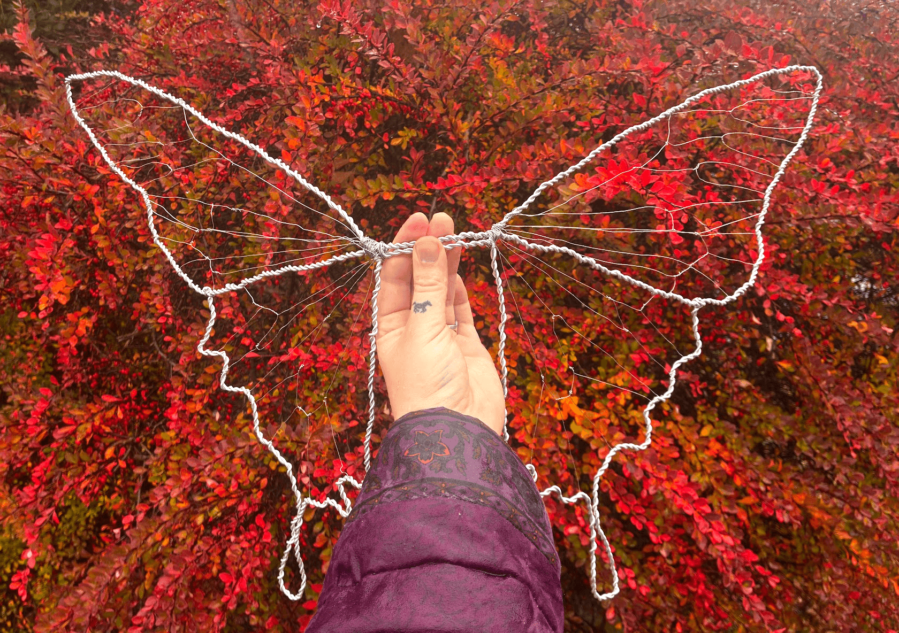
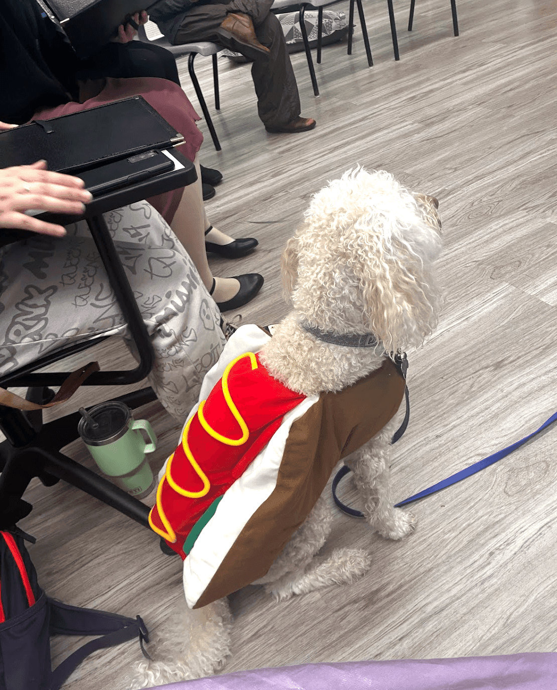
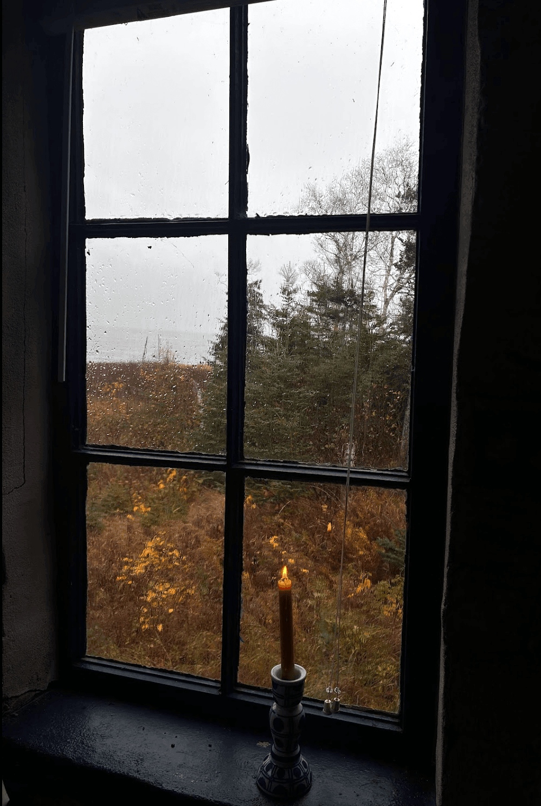
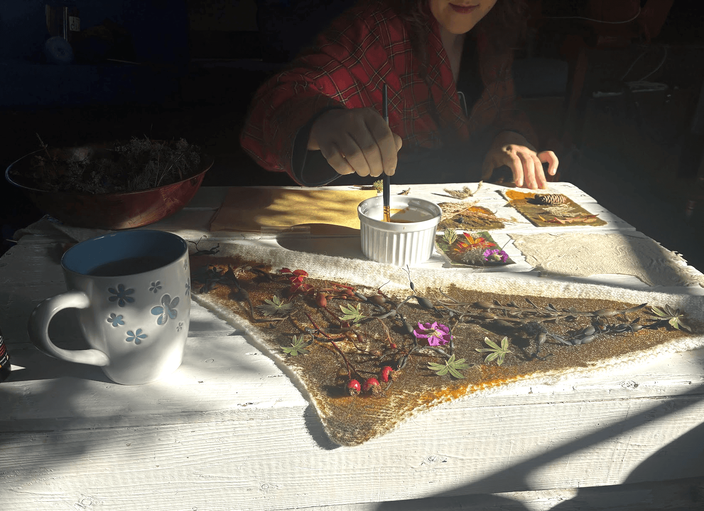
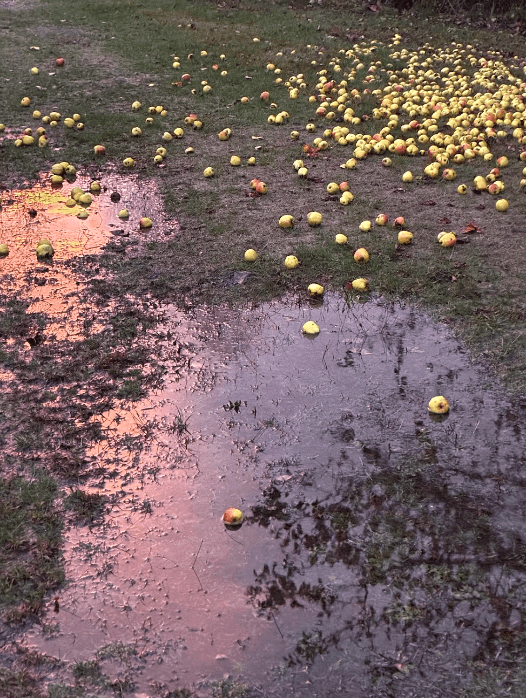
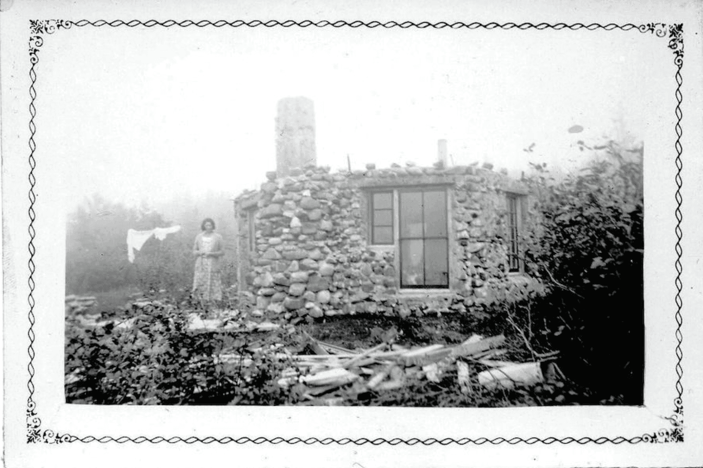

hey, it's been a while...

currently in the library "studying" and thought a new blog post might be a fantastic method of procrastination. probably not my most museful ramblings here, but I would love to share some pictures from the fall.

## knitting

finished [Nic's socks](https://www.ravelry.com/projects/jay777marie/dk-weight-vanilla-socks) (I think the day after my last post?). Ran out of orange yarn so he gets a funky toe. DK socks are fun... fingering weight not so much. I guess I am a little impatient haha. also made a bandana and pair of mittens. the mittens were done up in malbrigio rasta which is so soft and bulky; it was the closest to instant gratification you can get with knitting. I'm working on my first colourwork project now! (see birdy gauge swatch)

Since it's gotten cold, I've been getting a lot of wear out of the sweaters I've made. Would love to cast on another over winter break.

## swimming

on a ridiculously warm october day, Willow and I went for a lovely swim between my classes. tried my best to soak in the feeling of warm moss under my feet, and all the warm colours.

my next swim was much colder... but serves as a segue into the next heading

## amelia's cottage

spent reading week at Amelia's cottage with Orion, Adèsse, and, for a brief period, Nic. can't imagine a better place to study than by a big window looking over a lake. I kayaked and made a purple-velvet cake with toothpaste-coloured icing. it was a very luxurious getaway with terrific company and fancy soups.

while in the area, we went to Lunenberg for a day and I picked up some records:

\- The Time of the Foxgloves, micheal Hurley

\- Sweetkorn, Micheal Hurley

\- Stuff Like That There, Yo La Tengo

\- Souvenirs, Emahoy Tsege Mariam Gebru

\- Elliott Smith, Elliott Smith

\- Foggy Mountain Breakdown, Flatt & Scruggs (nic finally obtained a banjo and has been feeling the Scruggs spirit)

## Goat Life and Death

said hello to two baby goats and goodbye to Prince the goat - feeling closer to the circle of goat life than ever. pigs and goats alike seem to be thrilled about all the pumpkins left over from Halloween. Sheep and horses are starting to fluff up for the cold weather approaching.

I also got to attend a workshop with [Shelby Dennis](https://www.facebook.com/milestoneequestrian96) talking about positive reinforcement with horses. there's such a need for things to shift with the culture of horsemanship, horses deserve better!

## hallowe'en

was very happy to be volunteering at SMILE on halloween so I got to see all the participants' costumes and show off my own. we did the monster mash many times. at choir rehearsal, the conductor's dog came dressed as a hotdog. I made myself a flower hat and wire wings. no decorations this year for Nic and I, unfortunately (although to be honest, I find pumpkin carving to be a sensory nightmare).

## blue cottage

oh, blue cottage, i love you so. i spent 4 days there the first weekend of November. One night with Adèsse there too, two nights alone. when I got there, it was just before dinner and the sun was nearly set, and I was feeling hazy after 3 consecutive days of migraines. Adèsse's yellow rain jacket hanging in front of the window looked so bright against the window that showed only shades of blue. You know, the kind of dusk that fades into shades of fountain pen blues, not succumbing to grey. I could see my breath most days there and the fog only cleared from the windows when the fire went out. The days feel so long there but they are easily filled by reading, making music, cooking, and tending to the fire.

Besides the fire crackling and rain water dripping on the concrete floors, it was the kind of quiet that is like squinting into the horizon, very close to the mythical (impossible) idea of "silence." The wind and rain woke me up often in the night. It made me think of the last owner of the cottage, the Whitmans, and I think [the story](https://centreville-kings-county.com/wp-content/uploads/March-2017-CP-Web.pdf) goes that they stayed during a storm and his Mrs. Whitman got so rattled she swore never to come back. The mist reminded me of an old picture of the cottages being built (see pic #6 below).

 cottage")

## media

### books in progress this Fall

finished the Pynchon but the rest is still pending

\- The Treasure Hunters Club, Tom Ryan (a cliché but cozy Nova Scotia mystery)

\- The Crying of Lot 49, Thomas Pynchon (holy fuck, I won't even try to summarize)

\- The Listening Book, W.A. Mathieu (he gets it, music is so cool)

### most played albums this Fall

honestly, listening more for comfort and familiarity than exploration these days, but i suspect that will change when finals pass

\- you want it darker, leonord cohen 

\- colour green, sibyelle baier

\- beacause i was in love, sharon van etten

that's it for now! wish me luck as I enter my penultimate finals season.
