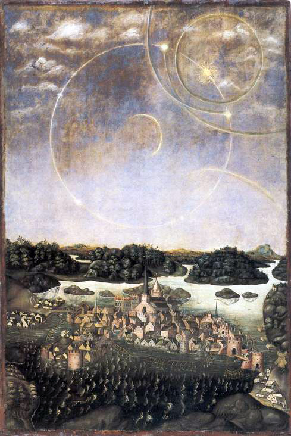
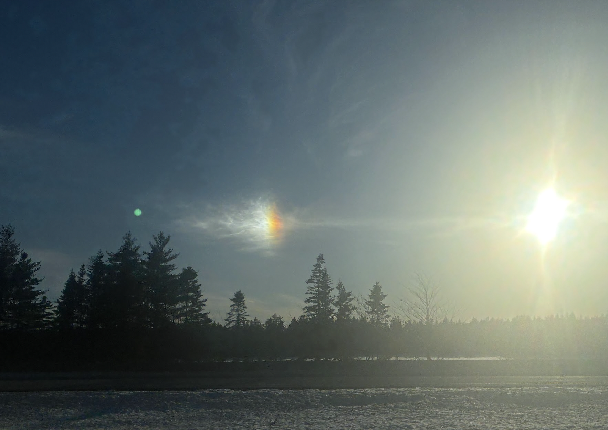
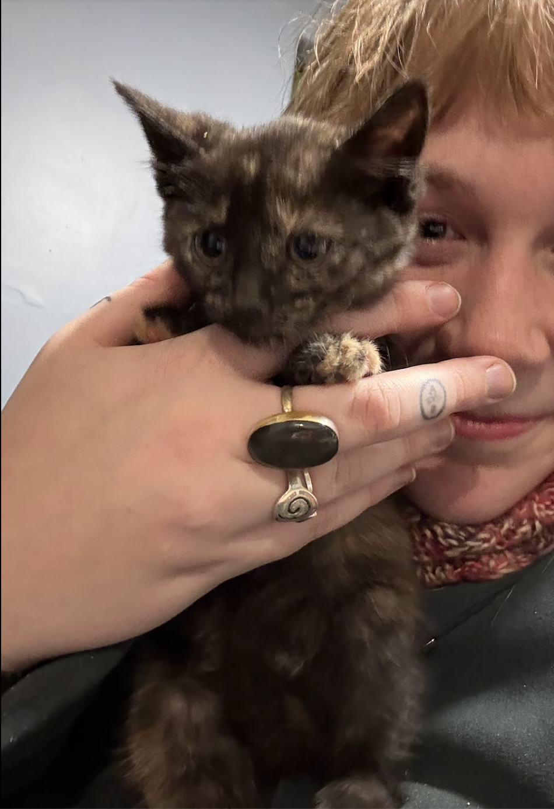

i'm so full of words but unsure what I have to say. here goes nothing:

the oldest depiction of a sundog is a Swedish oil painting from 1575. i doubt the wonder I felt seeing one for the first time was much different from the wonder that compelled Elbfas to paint Vädersolstavlan. when Adèsse drove us to/from the Culture is Critical rally in Halifax, I saw my first sundog, four bald eagles, and one deer (strangely out during daytime). I thought about the thread between me and that painting, all the glistening little threads in this big web woven by time and culture and art, how massive yet delicate it all is, how intricately woven yet easily undone like a knitting project slipped off its needles.

I'm grateful for a place to put my anger these days. In protests people are chanting, cheering, yelling, so loud that I can't even pick out my voice, it feels like hardly any sound comes out but I leave with my throat hoarse. Righteous anger spills out as easily as breathing, the unnatural thing is keeping in contained. Shame on Tim who hid inside like a coward. I wish I could organize my words like speakers at rallies, I try to soak it all in. Someone said something about how we're being stripped of our capacity to care for each other in the ways we already know how. If we can't locate ourselves in relation to each other through art, in context and heritage, we are lost to the isolation of capitalism.

twice this week I dreamed that I had been abducted by aliens. I've never had this dream before. It was just like in the show the x-files and all the windows in the apartment were exploding with bright white light and I was immobile but knew trying to tell Nic "Help! The aliens are here." these kinds of dreams are supposed to signify some big change coming against your will - that seems right. I hope it's a good one, anyway. a dream story I'm grateful to carry lately comes from my osteopath who told me about how she dreamt she smelled danger on someone's sweat but tried to suppress her intuition, and sure enough danger came. the wolf-self of dreaming sniffs out what I can't see. she told me to ask questions to my dream, try it out, they will answer. does anyone else dream vividly all night every night? are they answering questions you have yet to ask?

## a catching-up list

okay, I don't want to do the normal structure of summarizing my life since it's been so long, so here are some highlights since I've posted last:

* I sang my last couple concerts with Acadia singers, we had a whole procession with candles and a harpist. there was a very snowy bus ride where every window had iced over. i had no idea where we were going but I won $100 on a scratch ticket while en route
* a couple very cold swims in the river
* i've been really bummed about school ... the program shutting down... talking about internship everyday when I don't have one... adjusting to a new practicum when burned out. But I only have just over a month to go.
* one day I had a hard morning and went out in the field and laid myself over Spaghetti the horse, then Gina arrived with the smallest kitten I've ever seen. she told me about how all the horses had sparkled with frost that morning
* on the solstice, I watched an incredible pony glow show. I also volunteered at a Valentines pony photoshoot
* the nightdogs assembled gingerbread houses at the cottage grand pre
* i had a special evening playing big crystal singing bowls on the floor of Willow's bedroom. we sang along with them.
* I SPENT A WEEK AT SEA WITH MY GRANDPARENTS. was very spoiled. swam in a river in a cave, saw mayan ruins, thought a lot about imperialism

## two videos

[some rolls of film from a few years ago, mysteries now unveiled](https://youtu.be/u8uPMTvoceM)

[a montage from the cruise](https://youtu.be/1TnKnzY76wA)
