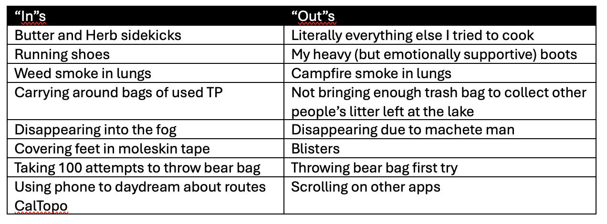
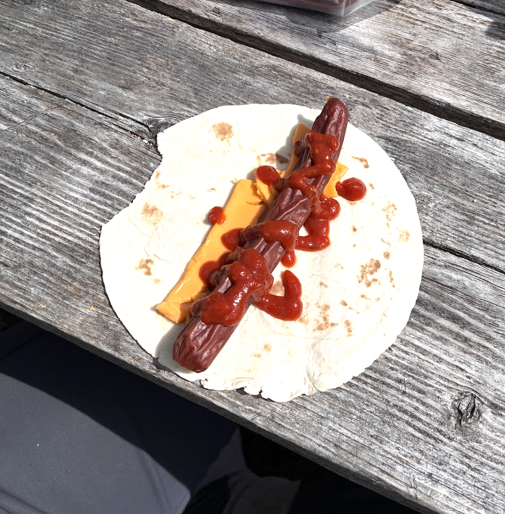

VIDEO: <https://www.youtube.com/watch?v=IgCMuGV2TaE>

The first week of May, Lisandre and I ventured into the South Panuke Wilderness Area (near Chester NS) and we got to try out backpacking/wild camping for the first time. It was an easy route to play it safe first time around – we followed an ATV trail (or dirt road for a couple brave truck drivers). 

The first day, we saw a bit more traffic - some trucks carrying canoes, some atvs - but once we entered the wilderness area, it was pretty much just us. To our surprise, there was an established campsite at Timber Lake, and someone had recently left some wood out there. The litter strewn about ☹ also suggested the site was popular, but nobody passed by in our time there. After a night of heavy rain, when we woke up to a foggy lake, it seemed like the whole world was hushed and fast asleep under the white downy fluff. Something greater than peaceful, there was something pleasantly stirring about it too. 

The views were magical and it felt special to get to know Lisandre in such a place! We’d hung out outside of class maybe twice before this? It turned out, I could not have asked for a better camping partner! It’ll be hard to beat this camping trip – since the lovely company was really what made it. Lisandre is hardcore! She is always game for a cold swim, or to walk 10km in the pouring rain, or to walk across a gravel road barefoot. Lisandre is also thoughtful, creative, hilarious, and incredibly kind. Plus, we smoked enough pot that I was silly enough to try speaking French and it reminded me how I miss the language! 

Since getting back, all I can think about is when I’ll take my tent out again next. There was something surprisingly nice about waking up at dawn, so cold that you want to start walking. I felt like myself - no mirrors to pass by, changing clothes outside and feeling sun on bare skin. No energy was wasted wondering if I’m acting civil enough or looking clean enough. Time passes both more playfully and intentionally when the days are purely about when to eat, where to sleep, and hours of trail conversations swirl around in a non-lineal way. I feel better at being human out there. 

Besides an emergency alert warning of a “DANGEOUS MAN with a machete \[…] in a wooded area” just as the sun set on our first night on the trail, things went surprisingly well. I wasn’t sure how well we’d manage with such heavy packs, but we kept a pace around 4km an hour (when moving) and made good time. Best first backpacking trip ever!

the aforementioned 'rouleau de pizza' (so cursed)

