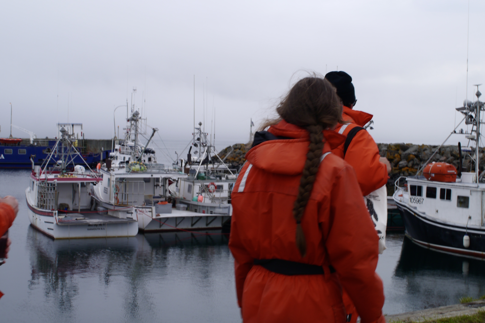
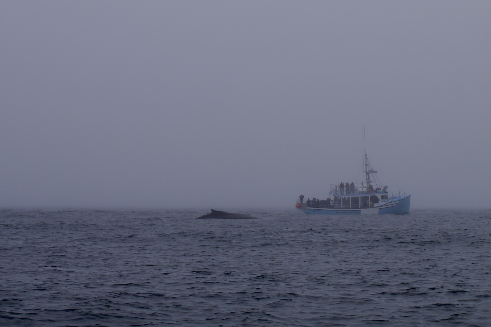
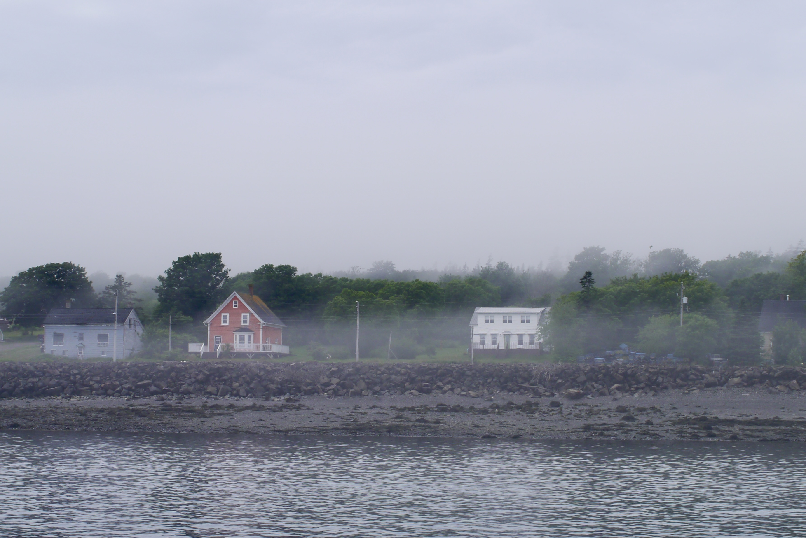
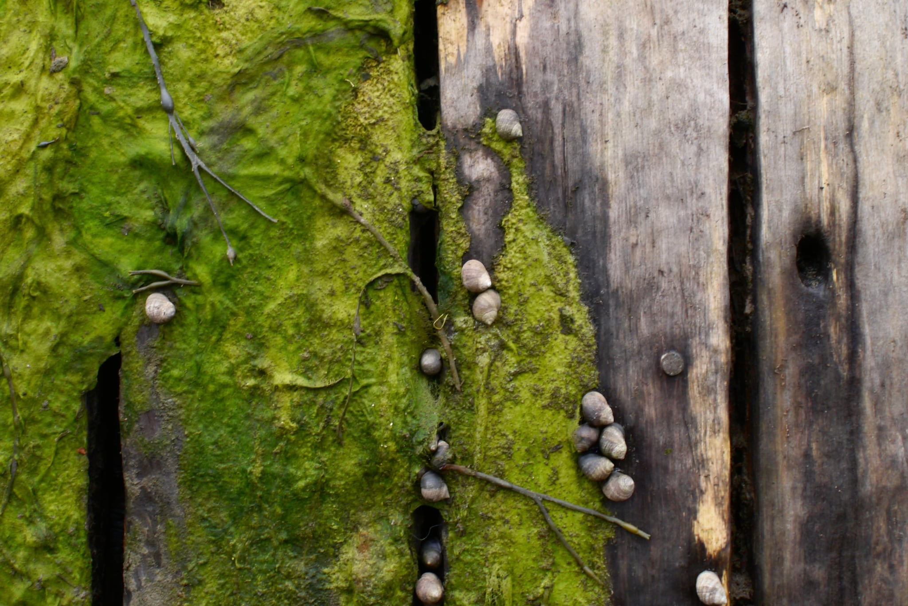
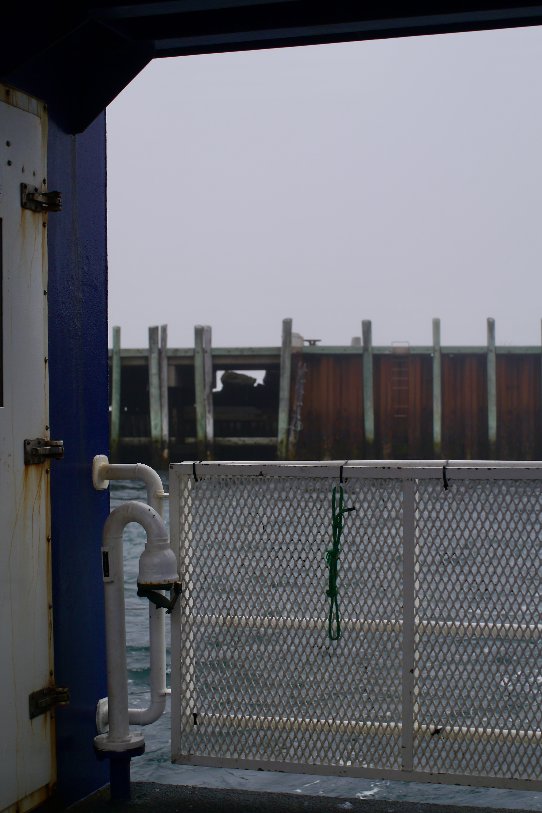
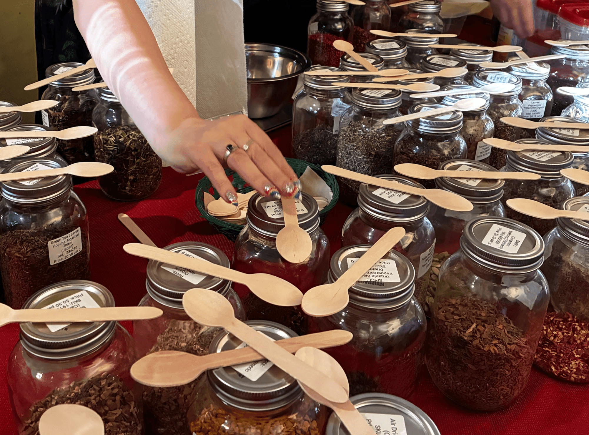
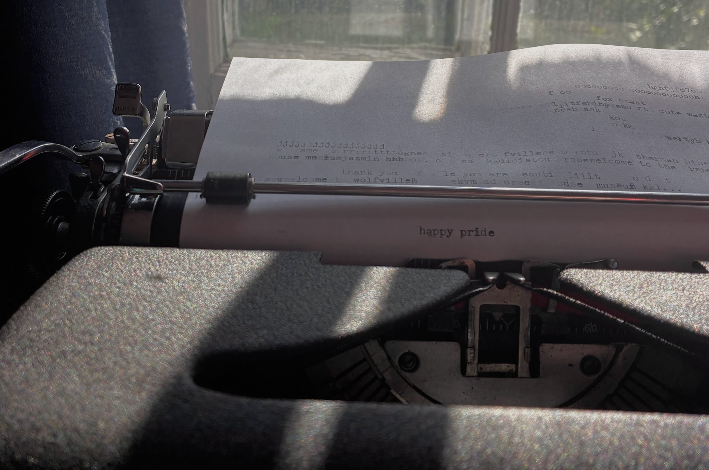
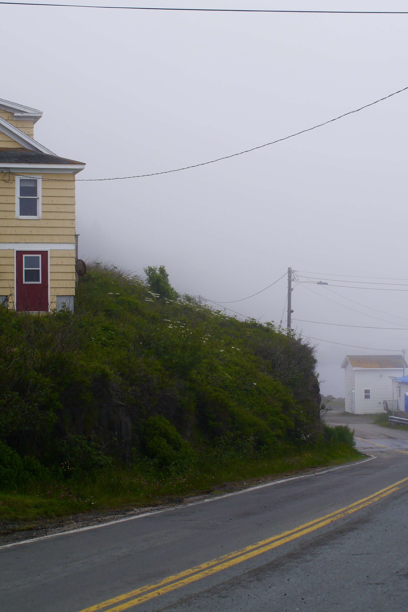
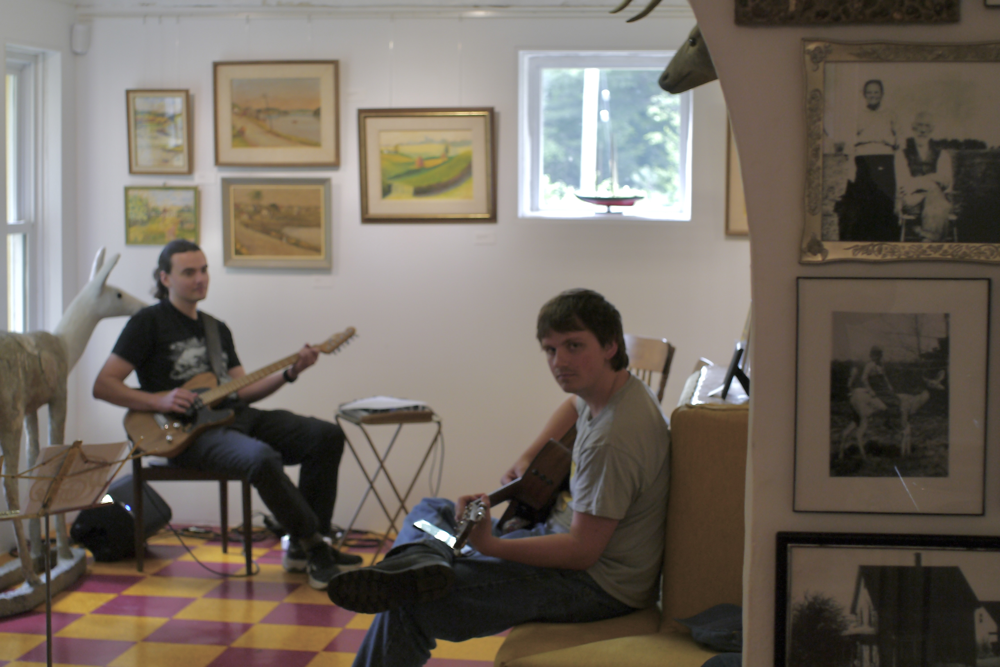

how long have a dreamed of seeing a whale? probably since before I imagined it was an option in this lifetime. it's almost too mystical of an encounter to even dream of being actualized... or at least too big for a child watching high rises grow taller each day in southern ontario. a couple years ago Paul asked me if I had any summer plans and “I want to see a whale” was all I could come up with. Even though I only had one ‘summer plan’ it somehow was overtaken by other obligations and forgotten until rhiannon messaged me that she was coming to Nova Scotia and wanted to go whale watching. 

we wore bright orange suits on a boat of people sitting in silence, listening beyond the of raindrops and dampening fog that held the sound of rain close around us. I was impressed at how the group kept quieter than most kids playing hide and seek, couples at the movie theatre, or patrons at the library. They told us blows from humpback whales can be heard a kilometre away. there was so much fog that the whole world looked monochrome, especially next to the rainbow striped hand warmers rhi wore (which she had knit with glow-in-the-dark star beads!)

I couldn’t believe it when I saw them (the whales). that part I can’t quite put into words, you will just have to get on a boat. the zodiac sailor said nobody knew why humpback whales slap the water but he figured it’s just because they can. 

after we saw the humpbacks, the sky could not keep being so coy and gave us the first hint of blue we’d seen since passing through digby neck. still, there was another curtain of fog waiting in front of the shore, as if a parting shower was a right of passage to return to the world we’d left. 

when rhi left my apartment later that night, I took out my guitar to play the song i wrote about her. the singing made sleep follow easily. That, and a special cup of tea, a blend I’d made when volunteering at a Pride event this week- blackberry leaf, peach, beet root, cardamom. (I think the leaves carried the warmth of that night with them; queer people building community over tea, with all the ghosties in the Randall House - the event included a queer tea history lesson!)

anyway, how long have a dreamed of seeing a whale? those of you who listen to me ramble often know that I’ve been wondering about dreams lately. 

questions: as someone who dreams vividly (and often terrifyingly), if I must be shown nightmares after dark, can’t I at least know a sweet dream or two in the daytime? how does a nightmare unfulfilled compare to a dream come true? can I fear or value one without feeling the same about the other? where is the line between dreams and nightmares? can one become the other? 

dare to dream that your new friends will become old friends (like rhiannon) or you will see a whale or even own a home someday. What’s the risk? Life will be unpredictible whether you dream or not. I’ll try to stay curious about wise hope and radical uncertainty. I’ll even dream that every dream (or nightmare) unfulfilled will be forgotten and replaced by a million new dreams before its absence is even known.

Still, I don’t mind if I continue to stumble on dreams more easily than I seek them out. Today when my friends were gathered around a concrete deer making silly music while I rug hooked, I thought ‘who would have figured?’ … who would have figured? surely not any past version of me, Rhiannon knows this best and yet I think she always knew. 

<3 jane
