yeah, pretty much just what the title says. I've been pretty tired after work and painting feels like such an ordeal, so I'll get creative with what I add pics of here...

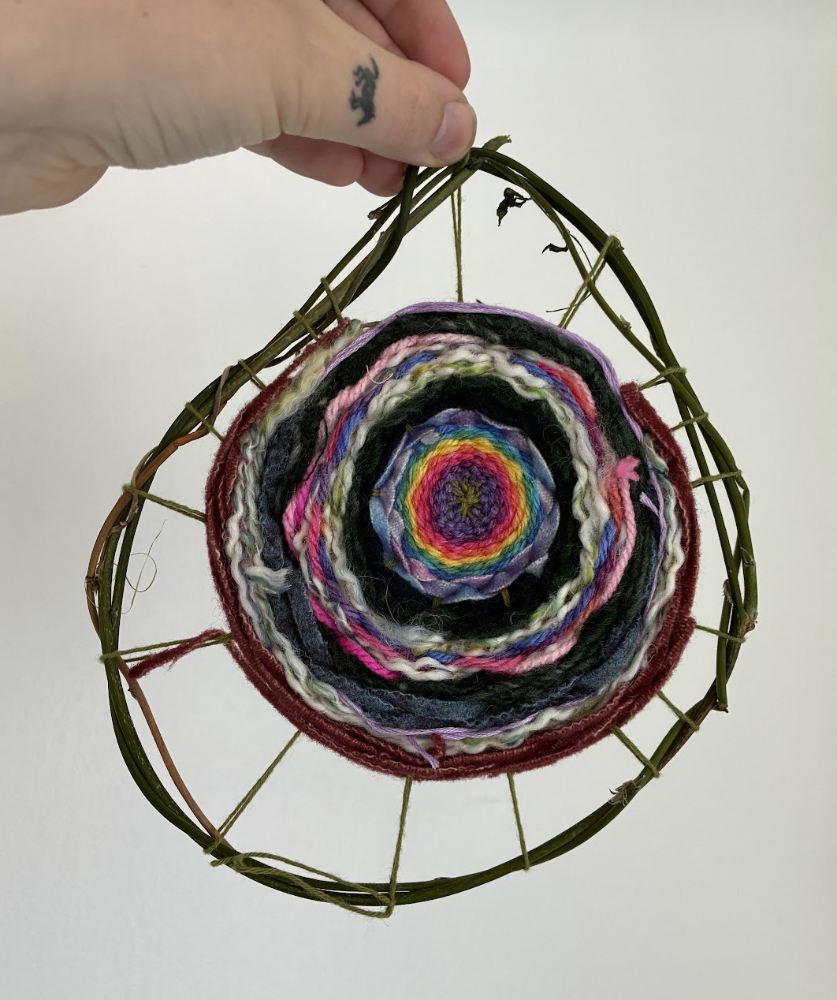

first attempt at weaving today, made the frame from wisteria and then used up some scraps at the museum

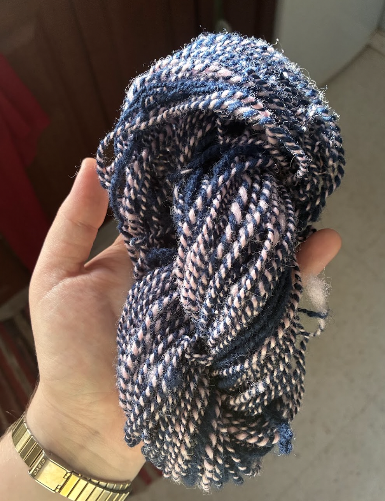

I've been spinning a lot! I think I will use this skein for another wisteria weaving thingy

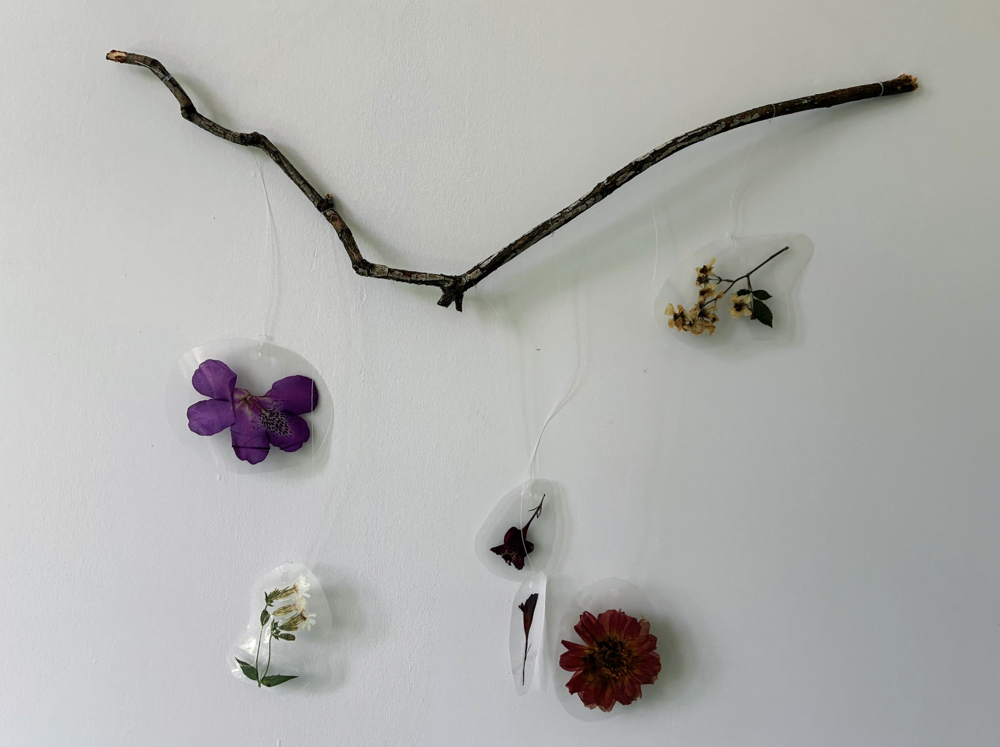

hosting a workshop making suncatchers with pressed flowers at the concrete house later this month

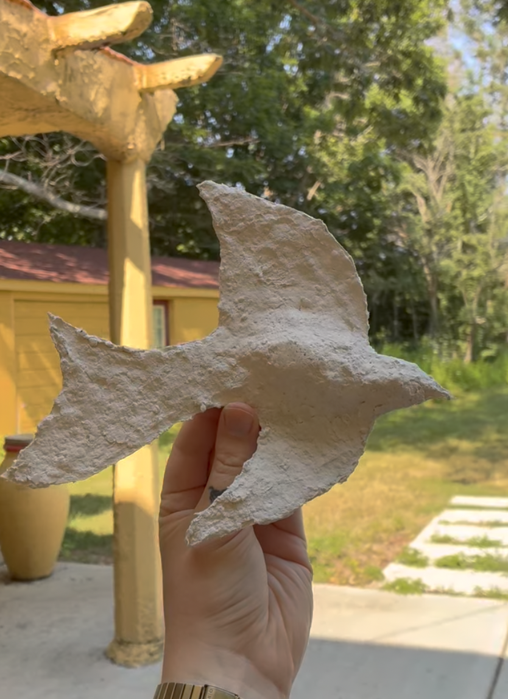

on wednesday we made birds with paper mache pulp

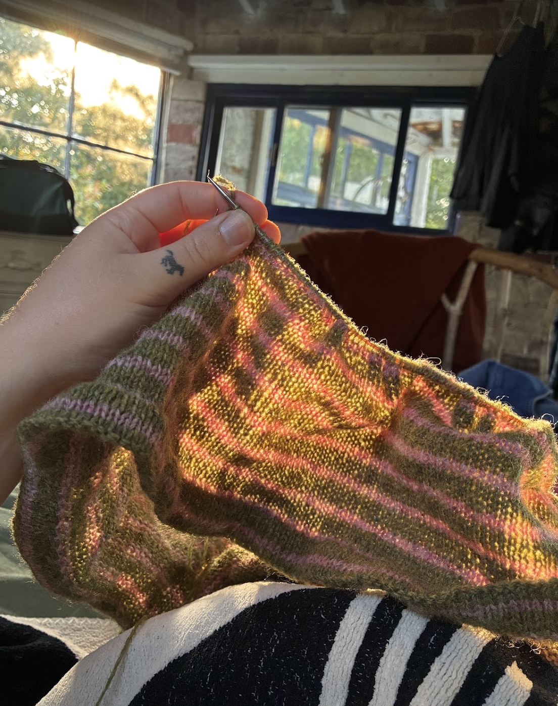

current knitting project, attempting to just freehand a skirt - it's just a tube with elastic, right?

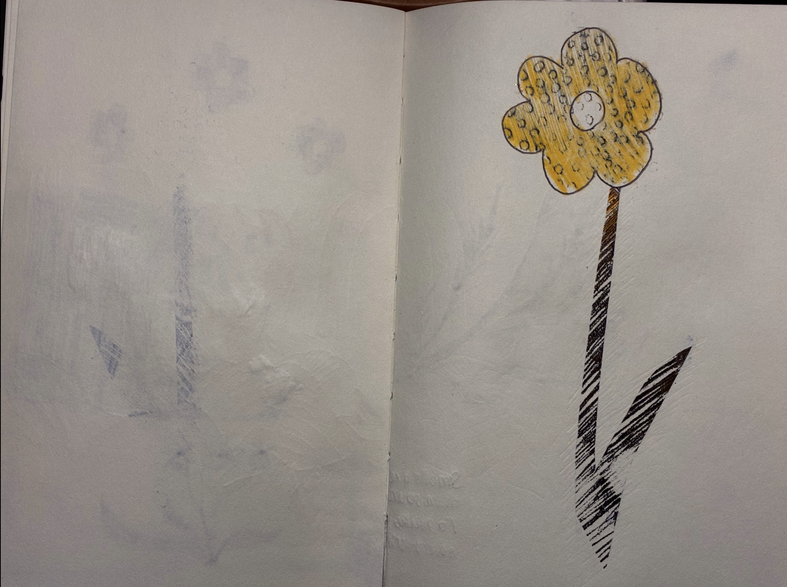

so i've been trying to make more bad art (instead of less good art) and yesterday i used  these tattoo transfer sheets and really felt like I was in the flow of quantity>quality which is right where I want to be

good quote from a nat geo... maybe I should be a fragrance therapist

the left page is notes from a psych class if you believe it

was really racing to finish this 'lone wolf' one because I was falling asleep

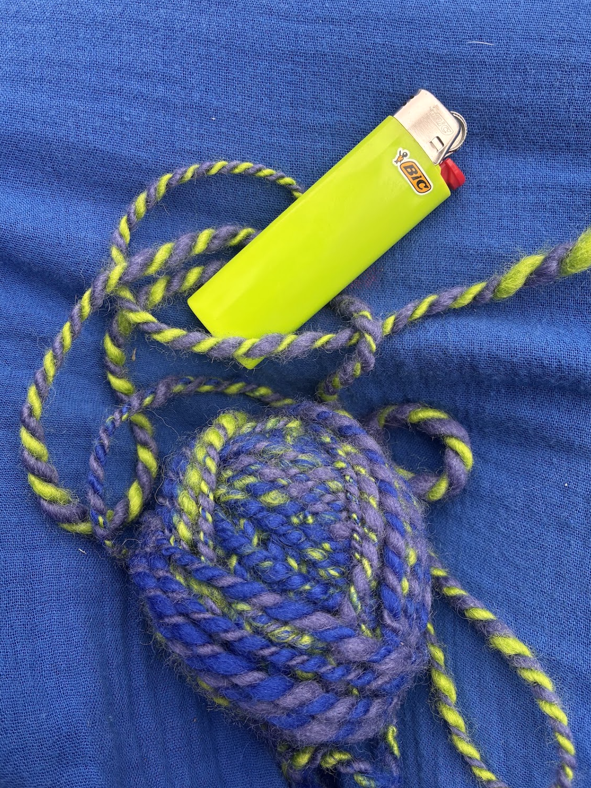

this was the first yarn i ever spun - the colours are pleasing

in a sketchbook that i bound ;~)

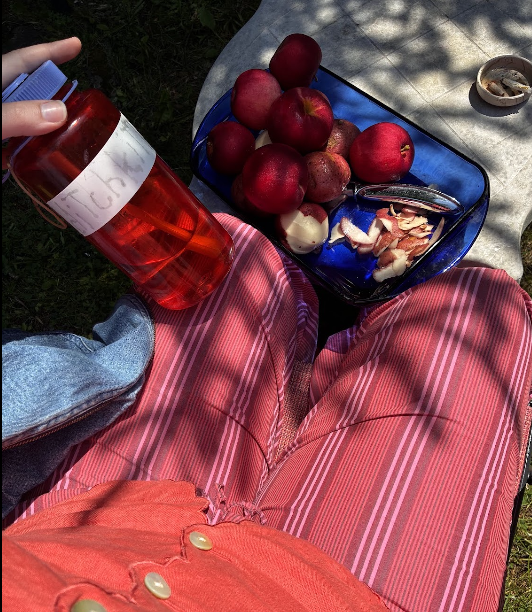

made lunenburg supper and dressed to match (lobster flops not pictured)

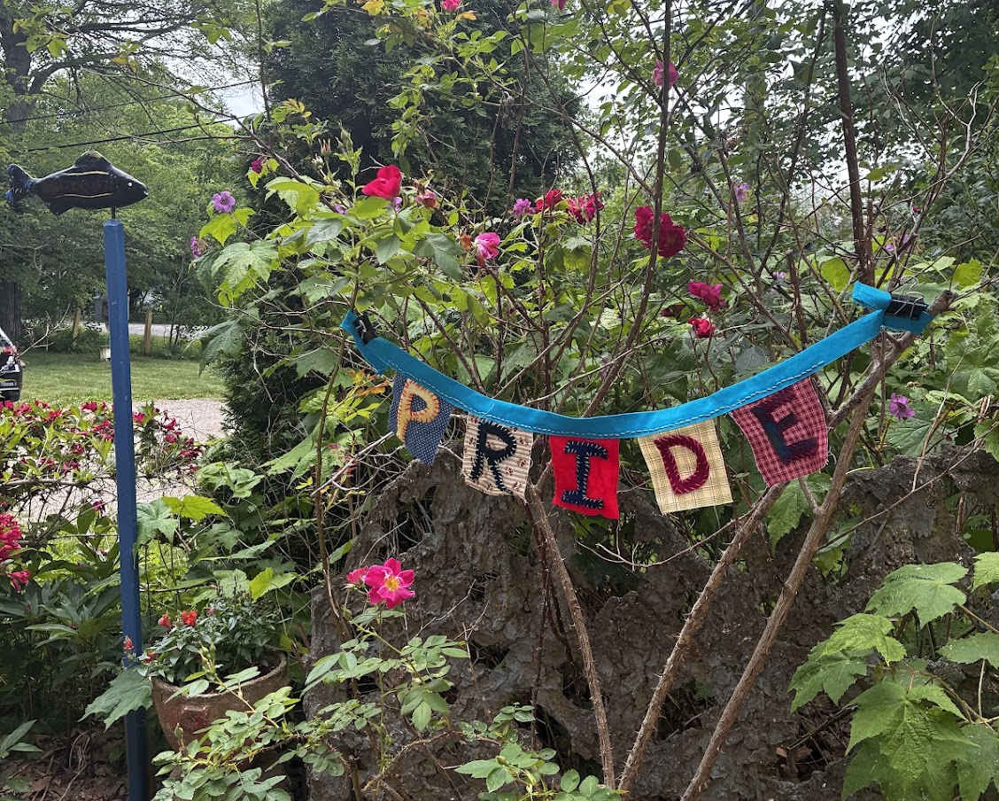

gay shit

okay this is long overdue but for my birthday week, I made a 7 page sketchbook. I did the first 6 days and left the last one blank to paint the pony party but then never got the photos to use as reference... then swept away with work. how sad. I'll finish it someday, though. here's a messy one from making cupcakes post-pony

this one is inspired by when I got a blank fortune cookie on my 22nd birthday and the northern lights were out. it was from finals season when I was frustrated with the meticulousness of art and just needed some experimentation. it's very big so I'm giving it to Abby and Ewan to deal with...

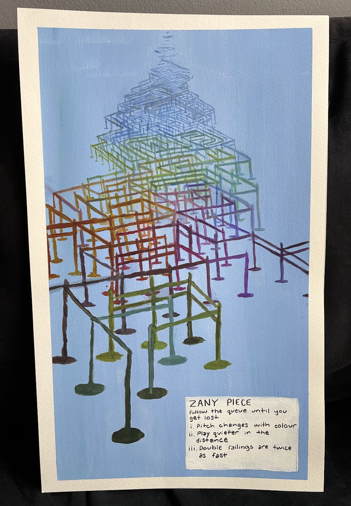

this one is pretty small. I went crazy while making it... wanted to make sure the maze was solveable and it was playable.... so I had my nose right up to the paper trying to paint tiny lines. not sure the result was worth it visually (Perspective is hard) but it's all about the journey, right?

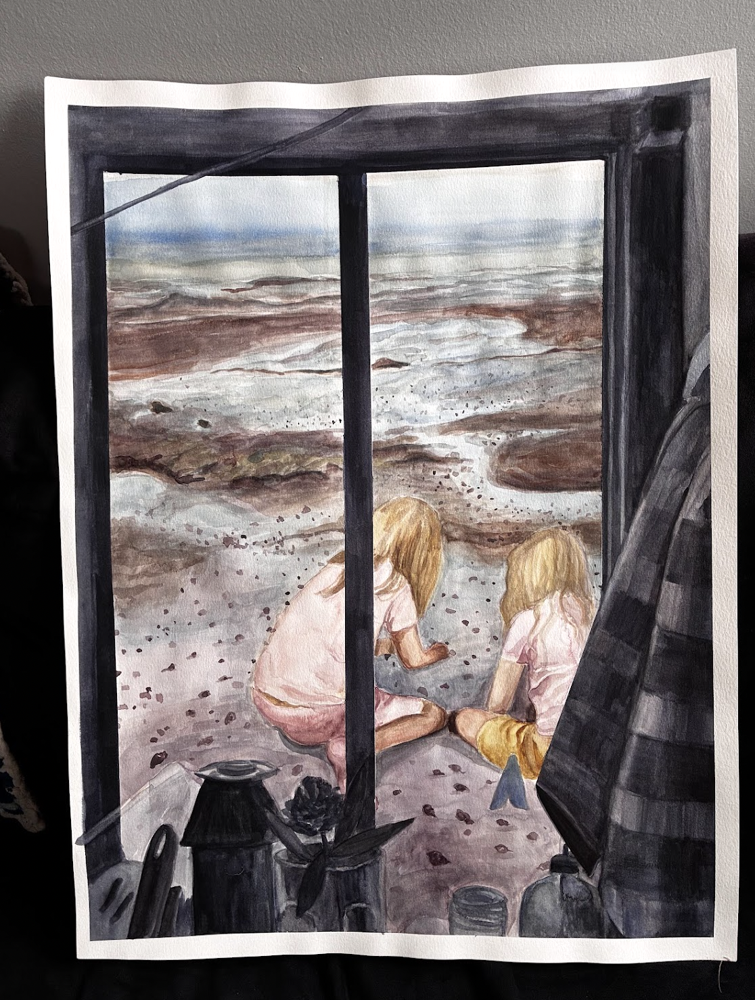

this turned out nice but wasn't fun

Baby Tera T. Toma (I <3 abortion - clumps of cells with teeth aren't babies)

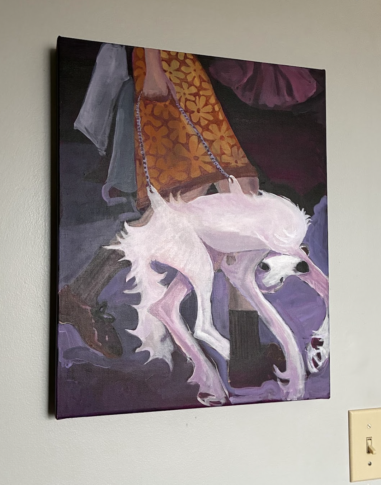

purse dog (consumerism) 

I missed a lot of rug hooking and knitting projects that I don't have photos of but... oh well, hopefully you're satisfied 

bye for now...
