my life has been so so full of beautiful things, summer buzzes buzy like cicadas - a little too loud for me - and it’s been frustrating when i've often found myself too tired or stressed to let it sink in. i’m trying to feel human again in a myriad of indirect ways, i’ve sorted all the loose items on my computer desktop, found my journal that I accidentally packed away with my camping gear in early June, I got the tattoo my grandma would hate, fixed my work schedule, the construction outside my bedroom window stopped, and I finally flipped my calendar - just in time, August is almost here. oh, and maybe I’ll even take my iron supplements….

when I stumble into sublime moments -  like petting an excited puppy, or being surrounded by fireflies with my childhood best friend, or spotting an owl on nic’s birthday, or laying on the ground under the air conditioner at work - i keep having the same little note from one of my old journal entries come to mind:

by being something, i am not all the other things. a shadow of the ones i love, in their shape and yet the absence of them. long forgotten hopes and prayers, if now fulfilled I would not notice.

here’s a song about it “many unnamed dreams came true” ... it probably still needs a bridge or something before I play it anywhere

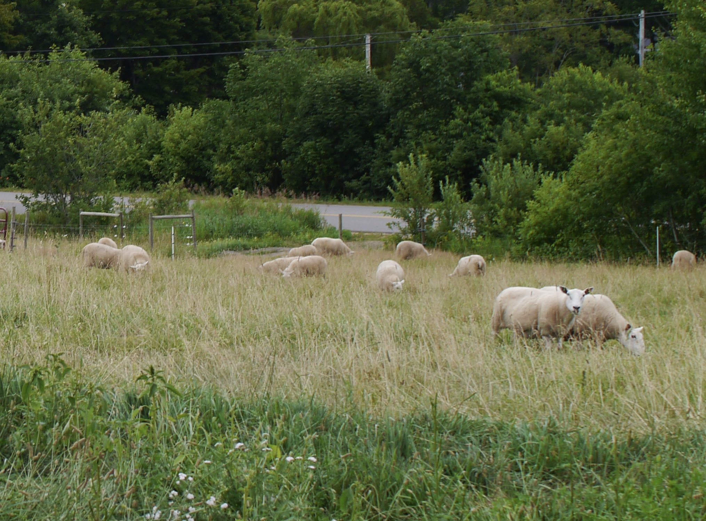

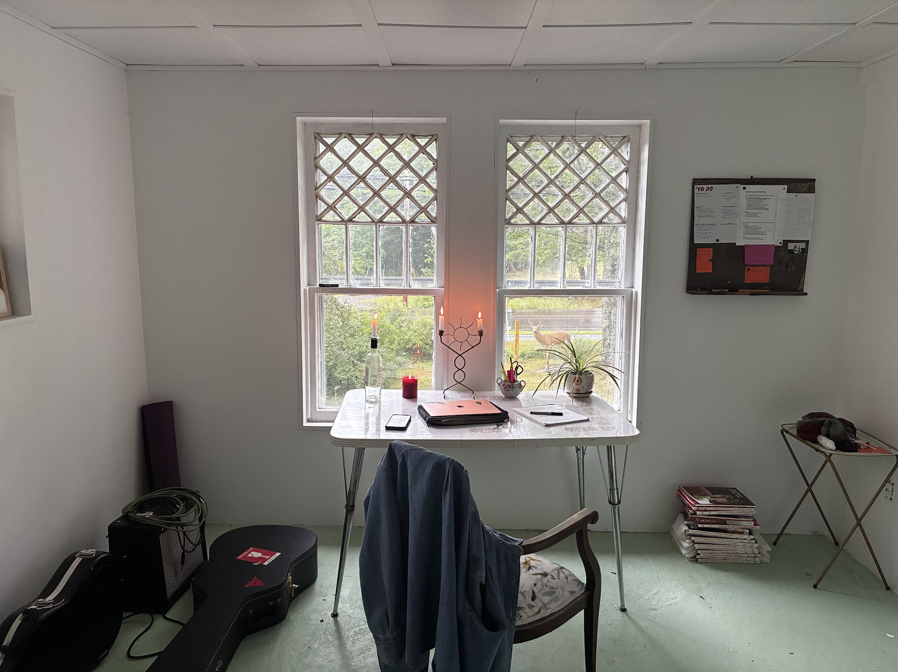

where i spend all my working hours <3 having an office is fun. work has been feeling meaningful, talking with people about socialism and art and history. i love the weirdos and unexpected conversations the most. some really cool kids come through the museum who love to rug hook and have parents who teach them about environmental and social justice, it gives me hope for the future. 

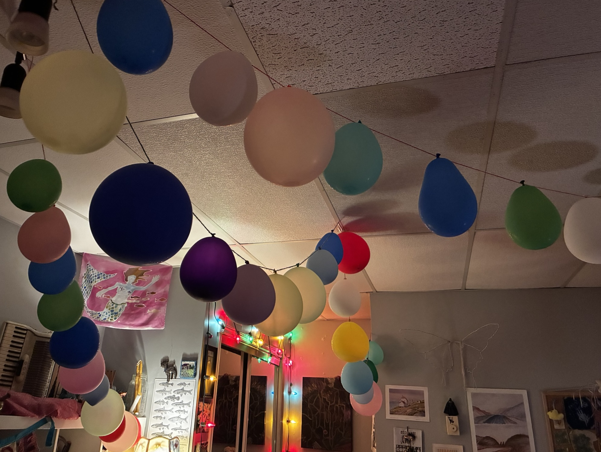

happy 24th, nic! I love you

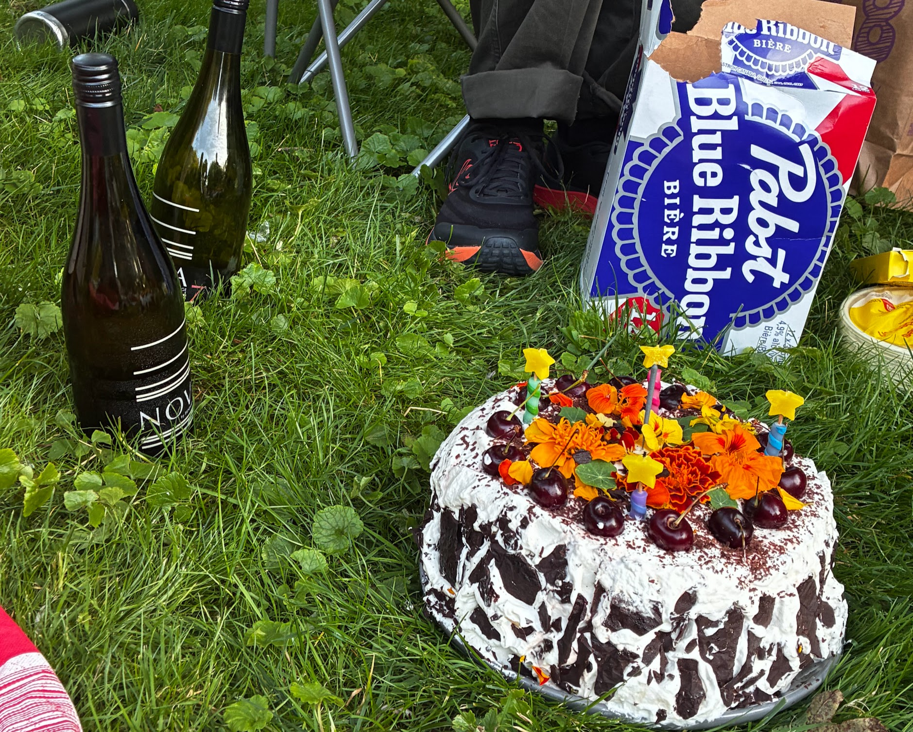

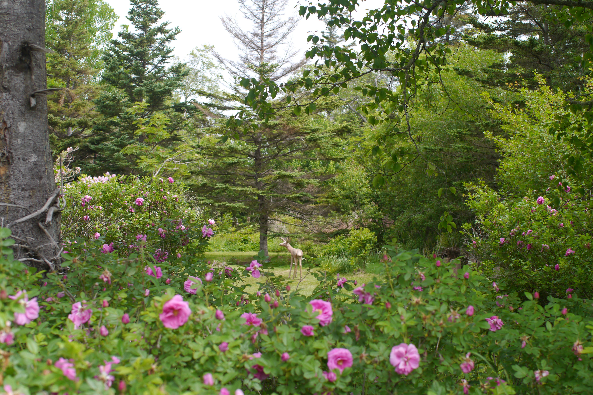

deer! (concrete)

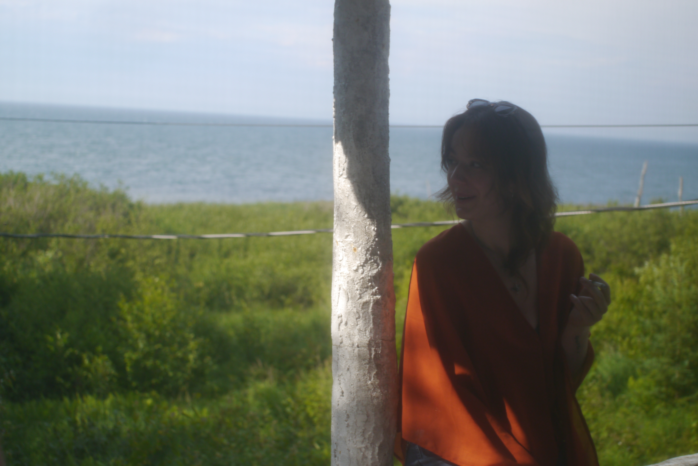

meghan came to the blue cottage! always so special to reunite. sewing and spinning by the fire, watching fireflies flash around the windows

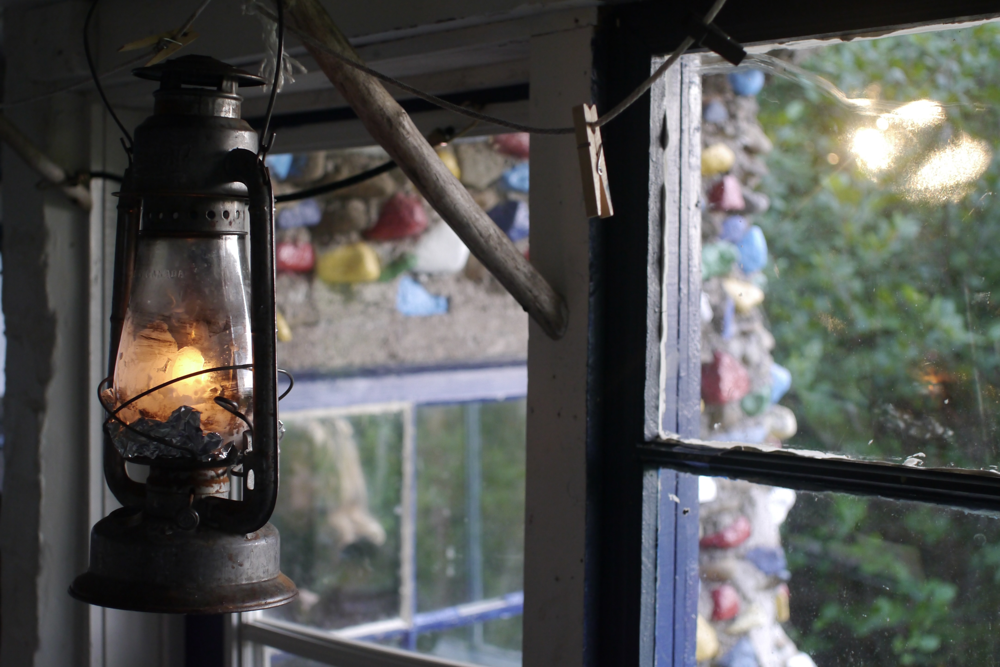

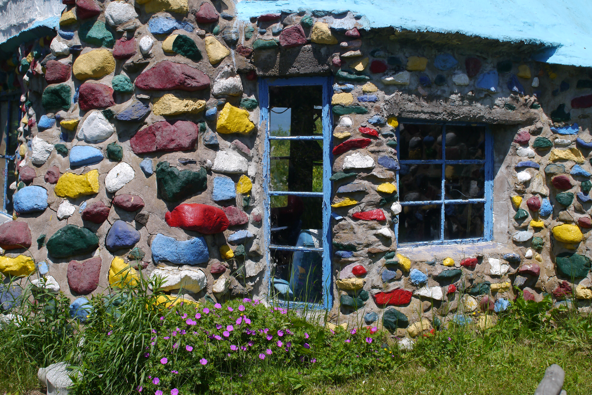

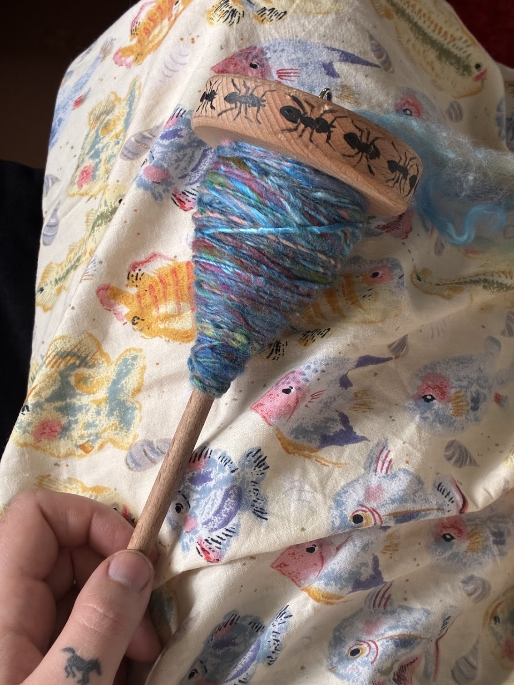

obsessively spinning 

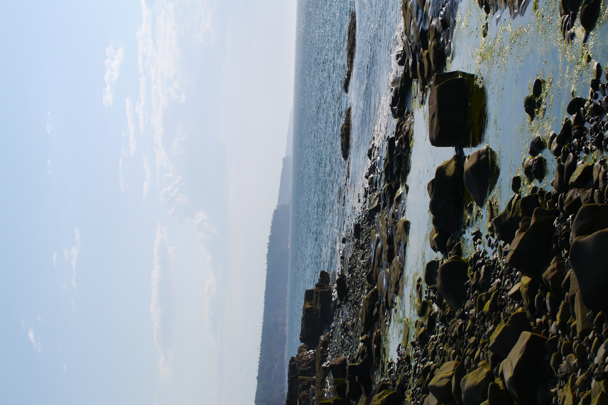

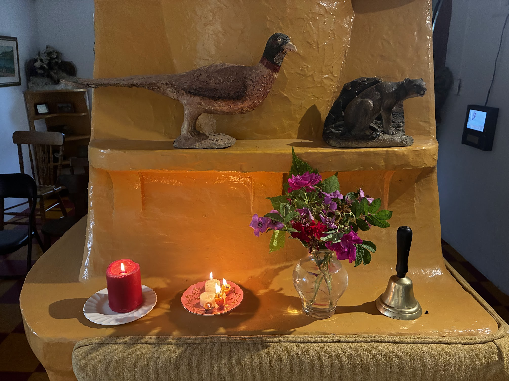

thanks for listening!

jane
