hi it’s Jane!! Orion helped me set up this blog today. can’t wait to share my every waking thought with the internet

## swimming

I’ve had a couple fantastic swims with friends lately. I had the honour of showing Amelia around Blomidon for the first time. It was one of those days where the sky and sea fade into each other and you cannot tell where one ends and another begins. The water was almost completely still except for the wake from a little boat on the water. The Borden Brook waterfall was only a trickle, even though it had rained recently. The lack of water revealed all the moss, like a green rug hung from the treetops. Amelia is always the brightest colour in my field of vision - rival to even the songbirds, lilies, and bluest skies. Reminding me that ‘natural colours’ are not dull at all.

Lumsden dam was the warmest swim I’ve had all year. Abby and I floated around for a while, until the sun settled behind the trees for the night. We saw an eagle too. Time with Abby always makes me feel more human.

Anyway, water may be the most miraculous substance we have here on earth. pure shape-shifting, life-giving, moon-swelling magic. the tides are magnetic for me, they measure time and situate me in place. I don’t know how I lived landlocked for so long. I attached an audio clip with a song I’ve been working on about water.

  

    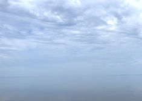
  

  

    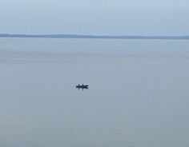
  

  

    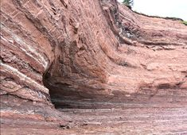
  

  

    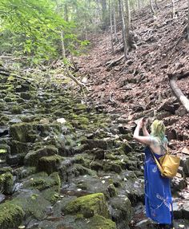
  

  

    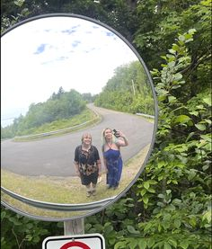
  

  

    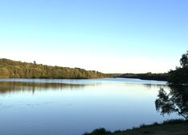
  

## fibre arts

baby’s first sweater! It smells like a sheep. I love the feeling of pure wool on my fingers. I love how the yarn dances like ribbons in the wind when I knit outside. I love opening my Merlin bird ID app and letting the birds serenade me as I knit.

I also finished one pink sock. Now, I’m working on my second sock and a pair of scrappy shorts. I’ve also been loving rug hooking lately. Working on a little mat for a mouse house.

PS Come see the _historic_ rug hooking exhibit at the Concrete Museum, it’ll make you smile
[concretehouse.ca](concretehouse.ca)

  

    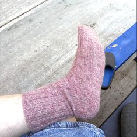
  

  

    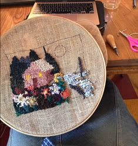
  

  

    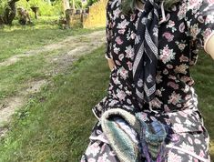
  

  

    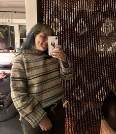
  

## Gardening

The first lily in my garden bloomed this morning! I wasn’t sure if it would, since it’s in a pot and we get limited sun.
I’ve been growing a lot of edible flowers (marigolds, nasturtium, pansies, fuchsia) at home and I’m excited to put them on Nic’s birthday cake - nothing says made with love like growing flowers from seed.
Luckily, pests haven’t been too bad this year but here’s a pic of Nic with some bugs.

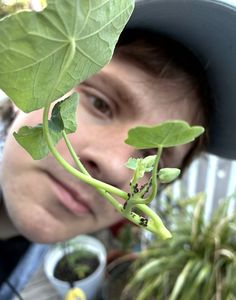

Gardens at the Concrete House are really shaping up. If anyone needs oregano, lemon balm, mint, or chives, I’ve got lots to share!

Thanks for reading. I’m off to see Spaghetti the horse. Talk soon.

xoxo Jane
