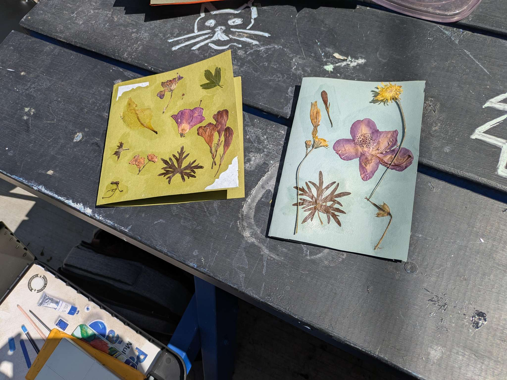
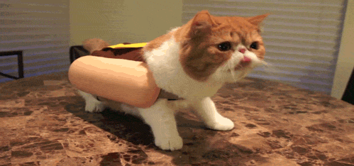

I've wanted to write about my experience at the Creative Music Workshop that happened a couple weeks ago, but I'm really at a loss for words. It was a wonderful experience to be that immersed in music. I had trouble returning to the real world—work, emails, all that. I hope I can hold on to some of that magic from that week.

  
  
This is a squirrel that was living in the concrete that Jane and I saw today. Very photogenic.

  
  
Some examples of postcards we made at the Concrete House a few weeks ago. It's nice to meet so many people, but I could use a little introvert break. It's been a lot.

  
  
Cat Dog sighting.

