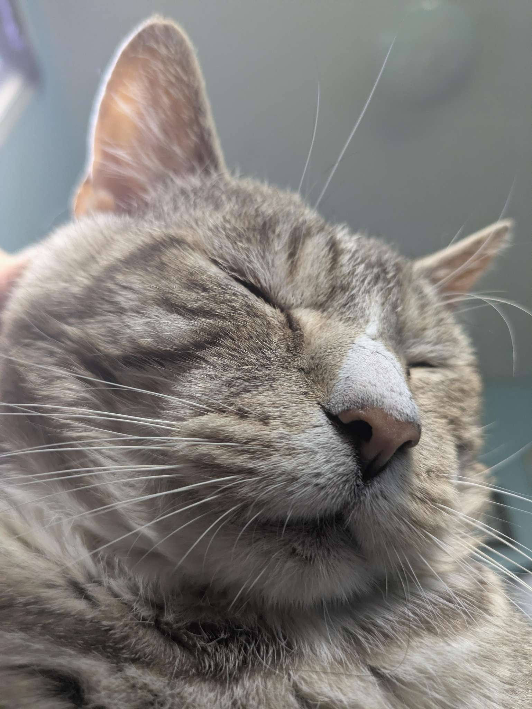
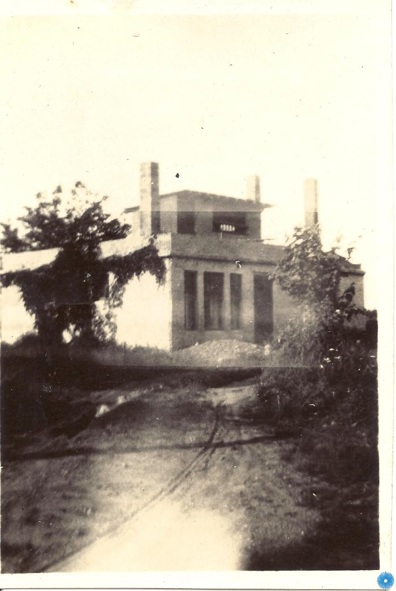

# Preramble

Been a while since my last one. I'll try and include everything I can think of.

  
  
Obligatory Iggy.

# Eyes
I have a genetic condition called Fundus Flavimaculatus, and its unfortunetly gotten worse since last year. I am still lucky, it could be a lot worse, but I have some niggling spots in my vision.

# Nightdogs
Working on a newsletter feature for this website. Stay tuned!

# Books
I've had Sputnik Sweetheart by Haruki Murakami on the backburner for a while now, but have just finished it this morning. I enjoyed it more than I have his other novels, I think that he does a little better with the shorter length of this novel. I'm going to check out some novels written by women next.

I burned through Small Things Like These.

Currently on Forget Me Not by Claire Allen, a basic mystery affair. I have a few others on the go too.

# Concrete House
Time at the concrete house is coming to a close. I am glad to have had the job but looking forward to the next thing. Our last event is tomorrow, an open mic.

  
  
Old pic of the ol concrete house.

# Movies

Watched Weapons with my dad yesterday. Thought it was a well constructed movie, but not as crazy about it as some others. Seems a large audience made it more fun but I think that if the movie needs that to be great it might not really be great.

Also watched Superman with my dad in theatres, then with Adèsse at home. I like it a lot, it's a fun superhero movie, might be one of my favourites now.

I'm sure there's some other stuff I've watched on my letterboxd.

# Insomnia

It's been really bad lately. Sleep is very important to functioning as a human, and I haven't had much lately. Pills help but make me feel worse the next day.

At the same time, insomnia is a very human experience, so I can take comfort that I am not alone in this.

  
  
Crazy.

# Games

I've been enjoying The Finals on my PC lately. It's a fast-paced skill-based FPS, with a lot of neat features and destruction physics. Reminds me a lot of fond childhood memories of Battlefield BC2 and even Brink which was probably the last game I preordered (learned by lesson).

Also getting back into chess has been fun, but maybe a little too much in a way. Don't wanna be thinking of moves late at night you know.
